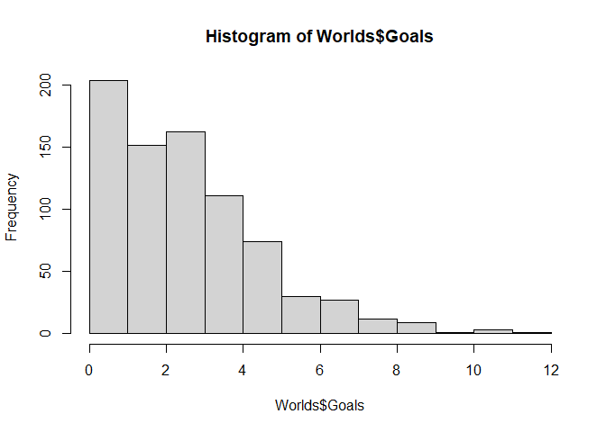
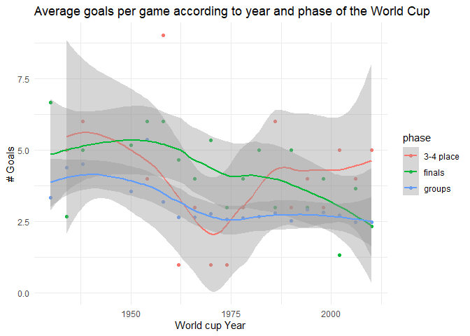

Soccer
================

## Introduction to progamming in R

We are going to analyze the performance of soccer teams throughout the
World Cups.

The data mining process begins by obtaining data. In the following code
we load a csv file found on the dataminingsoccer.com

``` r
soccer = "http://dataminingsoccer.com/de/wp-content/downloads/SoccerDataAllWorldCups.csv"
Worlds = read.table(soccer, sep=";",header=T)

head(Worlds)
```

    ##                       content...source year
    ## 1             www.DataMiningSoccer.com 1930
    ## 2          Football Result Predictions 1930
    ## 3             www.DataMiningSoccer.com 1930
    ## 4        Fussball Ergebnis Vorhersagen 1930
    ## 5             www.DataMiningSoccer.com 1930
    ## 6 Predicciones de Resultados de Fútbol 1930
    ##   country.where.wc..world.championship..took.place which.stage.of.the.turnament
    ## 1                                          Uruguay                        group
    ## 2                                          Uruguay                        group
    ## 3                                          Uruguay                        group
    ## 4                                          Uruguay                        group
    ## 5                                          Uruguay                        group
    ## 6                                          Uruguay                        group
    ##          date country.team.A country.team.B score.A score.B
    ## 1 13-Jul-1930         France         Mexico       4       1
    ## 2 15-Jul-1930      Argentina         France       1       0
    ## 3 16-Jul-1930          Chile         Mexico       3       0
    ## 4 19-Jul-1930          Chile         France       1       0
    ## 5 19-Jul-1930      Argentina         Mexico       6       3
    ## 6 22-Jul-1930      Argentina          Chile       3       1

## Generating Variables

let’s say that we want to analyze the number of goals per game
throughout the history of Soccer. For this, we must add the goals of
both teams in each match.

``` r
Worlds$Goals = Worlds$score.A + Worlds$score.B

hist(Worlds$Goals)
```

<!-- -->

Our experience tells us that the number of goals should vary depending
on the stage of the tournament. Before analyzing this, let’s see if the
tournament stages are comparable throughout the tournaments.

``` r
table(Worlds$which.stage.of.the.turnament)
```

    ## 
    ##                 final           final round           first round 
    ##                    18                     6                    16 
    ##                 group              play off         quarter final 
    ##                   527                     5                    60 
    ##                replay           round of 16  second round group a 
    ##                     4                    64                     9 
    ## second round group a   second round group b  second round group c 
    ##                     6                    15                     3 
    ##  second round group d            semi final     third place match 
    ##                     3                    32                    17

They are not all consistent, so we will create another variable that
will represent a simplification of the phase. We will define 2
simplified phases, advance phases and final phases. Those phases that
contain the word “final” belong to the second group, and the rest to the
first

``` r
# We create the variable "phase" with value "groups" for all games.
Worlds$phase = "groups"

# We change values if contains special words (final) in the stage of the tournament.
Worlds$phase  [
                grep("^final|^semi final|^final round",
                Worlds$which.stage.of.the.turnament)
              ] = "finals"

# We change values if contains special words (third) in the stage of the tournament.
Worlds$phase  [
                grep("third",
                Worlds$which.stage.of.the.turnament)
              ] = "3-4 place"

table(Worlds$phase)
```

    ## 
    ## 3-4 place    finals    groups 
    ##        17        56       712

Since we want to analyze the evolution of goals per phase throughout
history, we must average the goals for each phase / world cup.

``` r
data_phase = aggregate(Goals ~ year + phase, Worlds, mean)

head(data_phase)
```

    ##   year     phase Goals
    ## 1 1934 3-4 place     5
    ## 2 1938 3-4 place     6
    ## 3 1954 3-4 place     4
    ## 4 1958 3-4 place     9
    ## 5 1962 3-4 place     1
    ## 6 1966 3-4 place     3

We create a graph of the evolution of goals per game over time,
differentiated by simplified phase

<!-- -->
