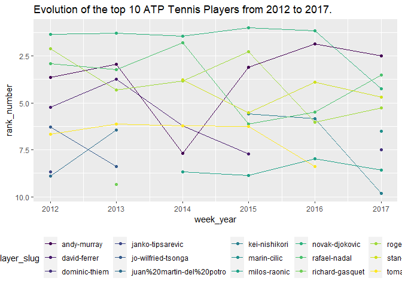

Tennis
================

## Data Types

There are various types of variables, such as numerical, text, date or
ordinals. To analyze them, the first thing we must do is load the
tabulate data, using the read.csv() function.

``` r
Tennis = read.csv("rankingsATP.csv")
  
str(Tennis)
```

    ## 'data.frame':    755021 obs. of  14 variables:
    ##  $ week_title     : chr  "2017.11.20" "2017.11.20" "2017.11.20" "2017.11.20" ...
    ##  $ week_year      : int  2017 2017 2017 2017 2017 2017 2017 2017 2017 2017 ...
    ##  $ week_month     : int  11 11 11 11 11 11 11 11 11 11 ...
    ##  $ week_day       : int  20 20 20 20 20 20 20 20 20 20 ...
    ##  $ rank_text      : chr  "1" "2" "3" "4" ...
    ##  $ rank_number    : int  1 2 3 4 5 6 7 8 9 10 ...
    ##  $ move_positions : int  NA NA 3 1 1 1 1 1 2 NA ...
    ##  $ move_direction : chr  "" "" "up" "down" ...
    ##  $ player_age     : int  31 36 26 20 24 29 26 25 32 26 ...
    ##  $ ranking_points : int  10645 9605 5150 4610 4015 3805 3775 3165 3150 2615 ...
    ##  $ tourneys_played: int  18 17 23 25 27 22 26 22 15 25 ...
    ##  $ player_url     : chr  "/en/players/rafael-nadal/n409/overview" "/en/players/roger-federer/f324/overview" "/en/players/grigor-dimitrov/d875/overview" "/en/players/alexander-zverev/z355/overview" ...
    ##  $ player_slug    : chr  "rafael-nadal" "roger-federer" "grigor-dimitrov" "alexander-zverev" ...
    ##  $ player_id      : chr  "n409" "f324" "d875" "z355" ...

In the table there are records with missing data (NULL) and invalid data
(NA). To validate the information, we use the summary() function.

``` r
summary(Tennis)
```

    ##   week_title          week_year      week_month        week_day    
    ##  Length:755021      Min.   :2010   Min.   : 1.000   Min.   : 1.00  
    ##  Class :character   1st Qu.:2012   1st Qu.: 4.000   1st Qu.: 9.00  
    ##  Mode  :character   Median :2014   Median : 7.000   Median :16.00  
    ##                     Mean   :2014   Mean   : 6.674   Mean   :15.83  
    ##                     3rd Qu.:2015   3rd Qu.:10.000   3rd Qu.:23.00  
    ##                     Max.   :2017   Max.   :12.000   Max.   :31.00  
    ##                                                                    
    ##   rank_text          rank_number   move_positions    move_direction    
    ##  Length:755021      Min.   :   1   Min.   :   1.00   Length:755021     
    ##  Class :character   1st Qu.: 509   1st Qu.:   2.00   Class :character  
    ##  Mode  :character   Median :1018   Median :   4.00   Mode  :character  
    ##                     Mean   :1016   Mean   :  17.07                     
    ##                     3rd Qu.:1510   3rd Qu.:  10.00                     
    ##                     Max.   :2271   Max.   :1354.00                     
    ##                                    NA's   :99317                       
    ##    player_age    ranking_points    tourneys_played  player_url       
    ##  Min.   :13.00   Min.   :    0.0   Min.   : 1.00   Length:755021     
    ##  1st Qu.:20.00   1st Qu.:    2.0   1st Qu.: 4.00   Class :character  
    ##  Median :22.00   Median :    9.0   Median :10.00   Mode  :character  
    ##  Mean   :23.04   Mean   :  120.8   Mean   :12.35                     
    ##  3rd Qu.:26.00   3rd Qu.:   65.0   3rd Qu.:20.00                     
    ##  Max.   :66.00   Max.   :16950.0   Max.   :45.00                     
    ##  NA's   :501                                                         
    ##  player_slug         player_id        
    ##  Length:755021      Length:755021     
    ##  Class :character   Class :character  
    ##  Mode  :character   Mode  :character  
    ##                                       
    ##                                       
    ##                                       
    ## 

We are also interested in exploring the number of rows and columns of
the board

``` r
dim(Tennis)
```

    ## [1] 755021     14

## Data pre-processing

Data pre-processing is a set of steps that must be run with a specific
use, it is not a general process for data.

In this case we will define the specific use as: Studying the annual
evolution of the top 10 ATP tennis players since the year 2012.

### Dimensionality reduction and variable selection

To simplify the analysis we will consider:

- Data from 2012.
- Variables week_year, rank_number, player_slug

``` r
data2 <- Tennis %>% 
            filter(week_year >= 2012) %>% 
            select(week_year, rank_number, player_slug)

dim(data2)
```

    ## [1] 576872      3

### Duplicated Data

If we want to preserve only the unique entities we can use the unique()
function.

``` r
unique_data <- unique(data2)

dim(unique_data)
```

    ## [1] 446749      3

### Sampling

To do simple sampling without replacement we can use the sample()
function.

``` r
# Generate a list of 1000 random numbers from the values between 1 and the number of unique records.
sampleIndex <- sample(1:nrow(unique_data),1000, replace = F)
sampleData <- unique_data[sampleIndex,]

dim(sampleData)
```

    ## [1] 1000    3

### Aggregation

If you would like to add the ranking for each player-year, we better use
directly the aggregate() function.

``` r
# Add the ranking_number variable calculating the median, for each week and player.
agg_df <- aggregate(rank_number ~ week_year + player_slug, data2, mean)

dim(agg_df)
```

    ## [1] 16028     3

### Normalization / Standardization

We already have the average ranking of the year, but we also want to
know the relative position of that ranking in each year. For this we
must divide the ranking of each year by the maximum value of that year.

With this the resulting variable will fluctuate between 0 and 1.

``` r
# calculate the maximum annual value with aggregate
max_rank <- aggregate(rank_number ~ week_year, agg_df, max)

# rename rank_number so it doesn't repeat when I merge
colnames(max_rank)[2] <- "max"

# merge aggregate data with the maximums, using the week as the id of the crossing
agg_df <- merge(agg_df, max_rank, by="week_year")

# generate relative ranking by dividing ranking by the maximum of that week
agg_df$rank_relative <- agg_df$rank_number / agg_df$max

summary(agg_df)
```

    ##    week_year    player_slug         rank_number          max      
    ##  Min.   :2012   Length:16028       Min.   :   1.0   Min.   :1965  
    ##  1st Qu.:2013   Class :character   1st Qu.: 684.1   1st Qu.:2096  
    ##  Median :2015   Mode  :character   Median :1274.4   Median :2197  
    ##  Mean   :2015                      Mean   :1168.6   Mean   :2155  
    ##  3rd Qu.:2016                      3rd Qu.:1669.5   3rd Qu.:2231  
    ##  Max.   :2017                      Max.   :2246.0   Max.   :2246  
    ##  rank_relative      
    ##  Min.   :0.0004482  
    ##  1st Qu.:0.3168596  
    ##  Median :0.5934861  
    ##  Mean   :0.5423283  
    ##  3rd Qu.:0.7786538  
    ##  Max.   :1.0000000

### Discretization

create a discrete variable that will have a value of 1 in case the
ranking relative is in the top 10, 0 otherwise.

``` r
agg_df$top10 <- as.numeric(agg_df$rank_number <= 10)

table(agg_df$top10)
```

    ## 
    ##     0     1 
    ## 15976    52

## Evolution of the top 10 ATP Tennis Players since the year 2012.

<!-- -->
