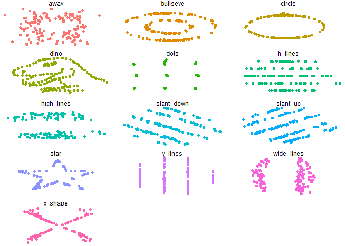
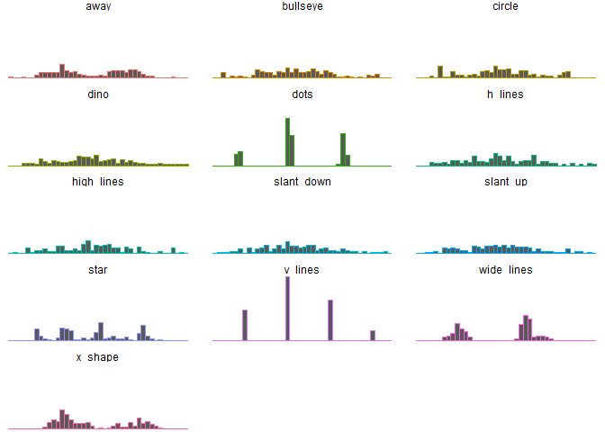
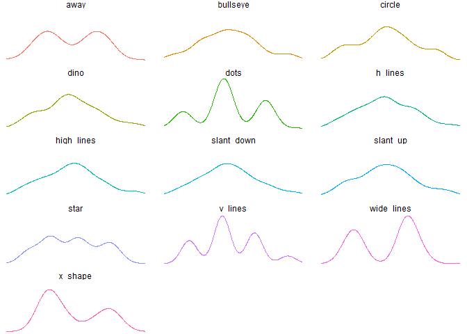
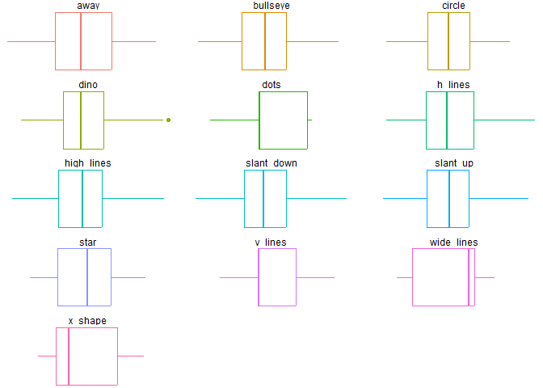
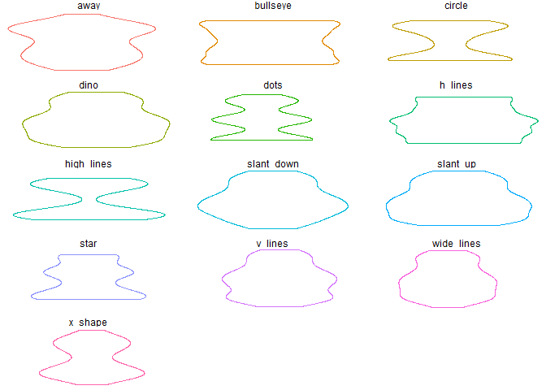
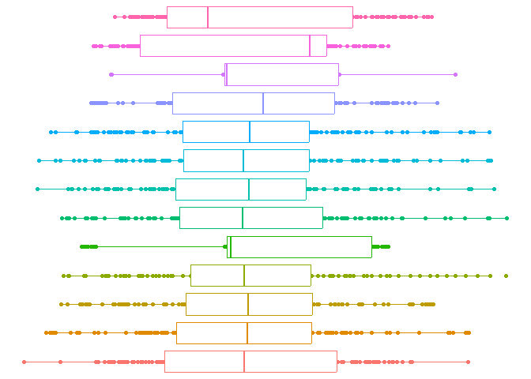

datasauRus
================

Analysis of the data set to summarize its main characteristics, using
statistical and visual methods.

Goals:

- Discover the underlying structure of the data.

- Identify relevant variables.

- Detect outliers and anomalies.

- Validate assumptions.

- Generate hypotheses from the data.

## Exploratory Data Analysis (EDA)

We are going to explore a data set called datasauRus, which consists of
the combination of 13 data sets with x and y coordinates.

``` r
library(tidyverse)
library(datasauRus)
library(proxy)
```

``` r
summary(datasaurus_dozen)
```

    ##    dataset                x               y           
    ##  Length:1846        Min.   :15.56   Min.   : 0.01512  
    ##  Class :character   1st Qu.:41.07   1st Qu.:22.56107  
    ##  Mode  :character   Median :52.59   Median :47.59445  
    ##                     Mean   :54.27   Mean   :47.83510  
    ##                     3rd Qu.:67.28   3rd Qu.:71.81078  
    ##                     Max.   :98.29   Max.   :99.69468

### Data statistics

We compute a variety of statistics and similarity metrics for each
unique category in the “datasaurus_dozen” dataset and present a summary
of these results using the glimpse() and summary() functions. Analysis
is performed to explore and understand the characteristics of the data
based on the “dataset” variable.

``` r
stats <- datasaurus_dozen %>% 
            group_by(dataset) %>% 
            summarize(
              mean_x    = mean(x),
              mean_y    = mean(y),
              std_dev_x = sd(x),
              std_dev_y = sd(y),
              corr_pears  = cor(x, y, method = "pearson"),
              corr_spear  = cor(x, y, method = "spearman"),
              corr_kendall  = cor(x, y, method = "kendall"),
              simil_cos = simil(list(x,y), method = "cosine") %>% as.numeric(),
              simil_jac = simil(list(x,y), method = "Jaccard") %>% as.numeric(),
              simil_sm = simil(list(x,y), method = "simple matching") %>% as.numeric(),
              simil_kul = simil(list(x,y), method = "Kulczynski1") %>% as.numeric(),
              dist_euc = dist(list(x,y), method = "Euclidean") %>% as.numeric(),   
              dist_manh = dist(list(x,y), method = "Manhattan") %>% as.numeric(),  
              dist_sup = dist(list(x,y), method = "supremum") %>% as.numeric(),   
              median_x    = median(x),
              median_y    = median(y),
              CV_x = sd(x) / mean(x),
              CV_y = sd(y) / mean(y),
              max_x = max(x),
              max_y = max(y)
            )

stats %>% glimpse()
```

    ## Rows: 13
    ## Columns: 21
    ## $ dataset      <chr> "away", "bullseye", "circle", "dino", "dots", "h_lines", …
    ## $ mean_x       <dbl> 54.26610, 54.26873, 54.26732, 54.26327, 54.26030, 54.2614…
    ## $ mean_y       <dbl> 47.83472, 47.83082, 47.83772, 47.83225, 47.83983, 47.8302…
    ## $ std_dev_x    <dbl> 16.76982, 16.76924, 16.76001, 16.76514, 16.76774, 16.7659…
    ## $ std_dev_y    <dbl> 26.93974, 26.93573, 26.93004, 26.93540, 26.93019, 26.9398…
    ## $ corr_pears   <dbl> -0.06412835, -0.06858639, -0.06834336, -0.06447185, -0.06…
    ## $ corr_spear   <dbl> -0.057299907, -0.078733673, -0.077291902, -0.065109041, -…
    ## $ corr_kendall <dbl> -0.034861652, -0.051842973, -0.017280991, -0.048312576, -…
    ## $ simil_cos    <dbl> 0.8242028, 0.8235815, 0.8237326, 0.8241943, 0.8248448, 0.…
    ## $ simil_jac    <dbl> 1, 1, 1, 1, 1, 1, 1, 1, 1, 1, 1, 1, 1
    ## $ simil_sm     <dbl> 1, 1, 1, 1, 1, 1, 1, 1, 1, 1, 1, 1, 1
    ## $ simil_kul    <dbl> Inf, Inf, Inf, Inf, Inf, Inf, Inf, Inf, Inf, Inf, Inf, In…
    ## $ dist_euc     <dbl> 395.0028, 395.6921, 395.5156, 394.9830, 394.2572, 394.588…
    ## $ dist_manh    <dbl> 3953.111, 4089.921, 4365.384, 3977.821, 3968.419, 3958.06…
    ## $ dist_sup     <dbl> 80.90001, 60.36668, 50.94506, 67.56410, 59.55409, 67.6842…
    ## $ median_x     <dbl> 53.34030, 53.84209, 54.02321, 53.33330, 50.97677, 53.0696…
    ## $ median_y     <dbl> 47.53527, 47.38294, 51.02502, 46.02560, 51.29929, 50.4735…
    ## $ CV_x         <dbl> 0.3090295, 0.3090037, 0.3088417, 0.3089593, 0.3090240, 0.…
    ## $ CV_y         <dbl> 0.5631839, 0.5631458, 0.5629457, 0.5631222, 0.5629241, 0.…
    ## $ max_x        <dbl> 91.63996, 91.73554, 85.66476, 98.20510, 77.95444, 98.2881…
    ## $ max_y        <dbl> 97.47577, 85.87623, 85.57813, 99.48720, 94.24933, 90.4589…

``` r
summary(pr_DB)
```

    ## * Similarity measures:
    ## angular, Braun-Blanquet, Chi-squared, correlation, cosine, Cramer,
    ## Dice, eDice, eJaccard, Fager, Faith, Gower, Hamman, Jaccard,
    ## Kulczynski1, Kulczynski2, Michael, Mountford, Mozley, Ochiai, Pearson,
    ## Phi, Phi-squared, Russel, simple matching, Simpson, Stiles, Tanimoto,
    ## Tschuprow, Yule, Yule2
    ## 
    ## * Distance measures:
    ## Bhjattacharyya, Bray, Canberra, Chord, divergence, Euclidean, fJaccard,
    ## Geodesic, Hellinger, Kullback, Levenshtein, Mahalanobis, Manhattan,
    ## Minkowski, Podani, Soergel, supremum, Wave, Whittaker

### Data Visualization

#### Dot plot

``` r
ggplot(datasaurus_dozen, aes(x=x, y=y, colour=dataset)) +
    geom_point() +
    theme_void() +
    theme(legend.position = "none") +
    facet_wrap(~dataset, ncol=3)
```

<!-- -->

#### Histogram

``` r
ggplot(datasaurus_dozen, aes(x=x,colour=dataset)) +
    geom_histogram(binwidth = 2) +
    theme_void() +
    theme(legend.position = "none") +
    facet_wrap(~dataset, ncol=3)
```

<!-- -->

#### Density

``` r
ggplot(datasaurus_dozen, aes(x=x,colour=dataset))+
    geom_density()+
    theme_void()+
    theme(legend.position = "none")+
    facet_wrap(~dataset, ncol=3)
```

<!-- -->

#### Boxplot

``` r
ggplot(datasaurus_dozen, aes(x=x, colour=dataset))+
    geom_boxplot()+
    theme_void()+
    theme(legend.position = "none")+
    facet_wrap(~dataset, ncol=3)
```

<!-- -->

#### Violin

``` r
ggplot(datasaurus_dozen, aes(x=x, y=y, colour=dataset))+
    geom_violin()+
    theme_void()+
    theme(legend.position = "none")+
    facet_wrap(~dataset, ncol=3)
```

<!-- -->

#### Boxplot_2

``` r
ggplot(datasaurus_dozen, aes(x=x, y=dataset, colour=dataset)) +
    geom_point() +
    geom_boxplot() +
    theme_void() +
    theme(legend.position = "none")
```

<!-- -->
