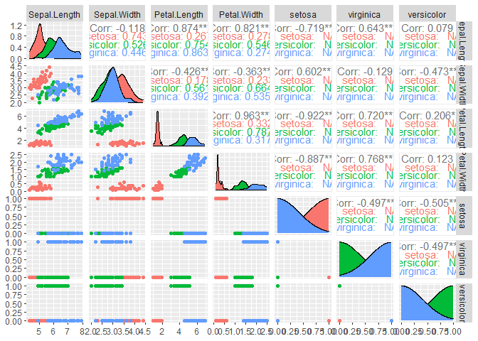
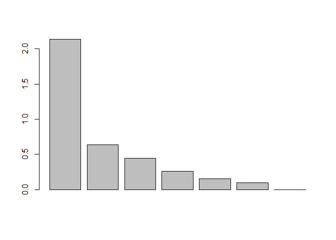
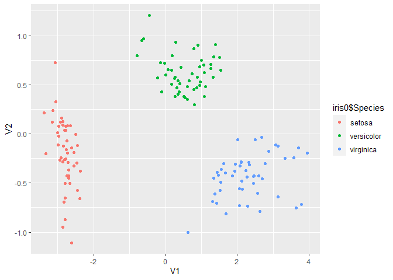
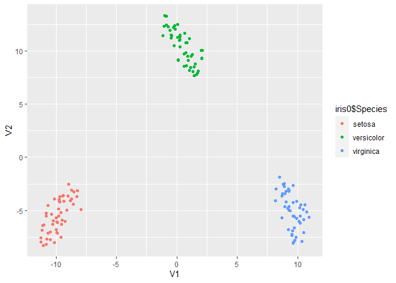

Iris
================

Attribute engineering consists of generating the list of attributes that
will be used in data analysis, from the set of original attributes.

This process can be done manually or algorithmically, and can be
approached in two ways:

- Attribute selection
- Attribute extraction.

## Attribute Selection

To test the different methods for selecting attributes we will use the
iris dataset, which comes in R base.

``` r
iris0 <- iris %>% unique()

str(iris0)
```

    ## 'data.frame':    149 obs. of  5 variables:
    ##  $ Sepal.Length: num  5.1 4.9 4.7 4.6 5 5.4 4.6 5 4.4 4.9 ...
    ##  $ Sepal.Width : num  3.5 3 3.2 3.1 3.6 3.9 3.4 3.4 2.9 3.1 ...
    ##  $ Petal.Length: num  1.4 1.4 1.3 1.5 1.4 1.7 1.4 1.5 1.4 1.5 ...
    ##  $ Petal.Width : num  0.2 0.2 0.2 0.2 0.2 0.4 0.3 0.2 0.2 0.1 ...
    ##  $ Species     : Factor w/ 3 levels "setosa","versicolor",..: 1 1 1 1 1 1 1 1 1 1 ...

``` r
# We must transform the Species variable into numeric, we do it by creating dummy variables.
iris0$setosa <- ifelse(iris0$Species == "setosa", 1, 0)
iris0$virginica <- ifelse(iris0$Species == "virginica", 1, 0)
iris0$versicolor <- ifelse(iris0$Species == "versicolor", 1, 0)

iris_num <- iris0 # We create a copy of the data but with only numerical variables.
iris_num$Species <- NULL
```

### Brute Force Algorithm

The brute force algorithm, also known as the exhaustive search
algorithm, is a straightforward method for solving problems by
systematically trying all possible solutions. It is a simple but
powerful technique that guarantees finding the optimal solution, albeit
at the cost of increased computational resources and time.

``` r
library(stuart) 

results <- bruteforce(iris_num, list(ra = names(iris_num)), 3, cores = 5)
```

    ##   |                                                                              |                                                                      |   0%

``` r
summary(results)  
```

    ## SUMMARY OF ANALYSIS:
    ## 
    ## Analysis Type: bruteforce 
    ## Estimation Software: lavaan 
    ## Models Estimated: 35 
    ## Replications of final solution: 1 
    ## Time Required: 40.65 seconds
    ## 
    ## Optimization History:
    ##  run pheromone rmsea         srmr      crel chisq df pvalue
    ##    1  0.000000    NA           NA        NA    NA NA     NA
    ##    4  2.012947     0 7.713060e-09 0.6347924     0  0     NA
    ##    8  2.983289     0 1.846159e-09 0.9611068     0  0     NA
    ## 
    ## Constructed Subtests:
    ## ra: Sepal.Length Petal.Length virginica

### Feature Selection in R (FSinR)

For the rest of the methods we use the FSinR (Feature Selection in R)
library.

To use it, we must first use an optimization method, where all the
available options are in searchAlgorithm

These algorithms will search for the optimum in the entire solution
space.

``` r
library(FSinR)   # feature selection

searcher <- searchAlgorithm('geneticAlgorithm')
searcher <- searchAlgorithm('tabu', 
  list(
    tamTabuList = 4, 
    iter = 5, 
    intensification=2, 
    iterIntensification=5, 
    diversification=1, 
    iterDiversification=5, 
    verbose=FALSE)
  )
searcher <- searchAlgorithm('antColony')
searcher <- searchAlgorithm('sequentialForwardSelection')
searcher <- searchAlgorithm('hillClimbing')
```

Then we have to define a variable to filter, the available variables are
in filterEvaluator

``` r
filter_data <- filterEvaluator("IEConsistency")
filter_data <- filterEvaluator('determinationCoefficient')
filter_data <- filterEvaluator('chiSquared')
filter_data <- filterEvaluator('MDLC') 
```

Finally we optimize the attributes, using the Species variable as a
reference to forecast

``` r
results <- featureSelection(iris0, 'Species', searcher, filter_data)
results$bestFeatures
```

    ##      Sepal.Length Sepal.Width Petal.Length Petal.Width setosa virginica
    ## [1,]            0           0            0           0      0         1
    ##      versicolor
    ## [1,]          0

You can also predict the reference variable using a wrapper function.
The available functions can be seen at wrapperEvaluator.

``` r
evaluator <- wrapperEvaluator("xgbLinear")
evaluator <- wrapperEvaluator("svmLinearWeights")
evaluator <- wrapperEvaluator("mlpWeightDecay")
evaluator <- wrapperEvaluator("lm")
evaluator <- wrapperEvaluator("knn")

results <- featureSelection(iris0, 'Species', searcher, evaluator)

results$bestFeatures
```

    ##      Sepal.Length Sepal.Width Petal.Length Petal.Width setosa virginica
    ## [1,]            0           0            1           0      0         0
    ##      versicolor
    ## [1,]          1

Finally, attributes can also be selected by direct searches.

Note that the FeatureSelection function is different from the previous
one.

``` r
directSearcher <- directSearchAlgorithm('selectKBest', list(k=3))

results <- directFeatureSelection(iris0, 'Species', directSearcher, evaluator)

results$bestFeatures
```

    ##      Sepal.Length Sepal.Width Petal.Length Petal.Width setosa virginica
    ## [1,]            1           0            1           1      0         0
    ##      versicolor
    ## [1,]          0

Now let’s visualize all the original variable pairs, see if we can see
clear patterns

``` r
library(GGally)

ggpairs(iris_num, aes(col=iris0$Species))
```

<!-- -->

## Attribute Extraction

For the extraction of attributes we will try different methodologies on
the same data. In all cases we will graph the data on the new
attributes, to see if they differ better than with the original
attributes.

### Principal Component Analysis (PCA)

Principal component analysis, or PCA, is a dimensionality reduction
method that is often used to reduce the dimensionality of large data
sets, by transforming a large set of variables into a smaller one that
still contains most of the information in the large set.

Reducing the number of variables of a data set naturally comes at the
expense of accuracy, but the trick in dimensionality reduction is to
trade a little accuracy for simplicity. Because smaller data sets are
easier to explore and visualize and make analyzing data points much
easier and faster for machine learning algorithms without extraneous
variables to process.

So, to sum up, the idea of PCA is simple — reduce the number of
variables of a data set, while preserving as much information as
possible.

``` r
PCA <- prcomp(iris_num)

barplot(PCA$sdev) ## we graph the variance contribution of each principal component
```

<!-- -->

``` r
predict(PCA) %>% as.data.frame() %>%  ggplot(aes(PC1,PC2, col=iris0$Species)) + geom_point()
```

<!-- -->

### Multidimensional Scaling (MDS)

Multidimensional scaling (MDS) is a means of visualizing the level of
similarity of individual cases of a dataset. MDS is used to translate
“information about the pairwise ‘distances’ among a set of n objects or
individuals” into a configuration of n points mapped into an abstract
Cartesian space.

More technically, MDS refers to a set of related ordination techniques
used in information visualization, in particular to display the
information contained in a distance matrix. It is a form of non-linear
dimensionality reduction.

Given a distance matrix with the distances between each pair of objects
in a set, and a chosen number of dimensions, N, an MDS algorithm places
each object into N-dimensional space (a lower-dimensional
representation) such that the between-object distances are preserved as
well as possible. For N = 1, 2, and 3, the resulting points can be
visualized on a scatter plot.

``` r
d <- dist(iris_num) # Euclidean distances between entities
MDS <- cmdscale(d,eig=TRUE, k=2) # k is the number of output dimensions

MDS$points %>% as.data.frame() %>% ggplot(aes(V1,V2, col=iris0$Species)) + geom_point()
```

<!-- -->

### Non-parametric multidimensional scaling (n-MDS)

In contrast to metric MDS, non-metric MDS finds both a non-parametric
monotonic relationship between the dissimilarities in the item-item
matrix and the Euclidean distances between items, and the location of
each item in the low-dimensional space.

NMDS is an indirect gradient analysis approach which produces an
ordination based on a distance or dissimilarity matrix. NMDS attempts to
represent, as closely as possible, the pairwise dissimilarity between
objects in a low-dimensional space.

The goal of NMDS is to represent the position of objects
(e.g. communities) in multidimensional space as accurately as possible
using a reduced number of dimensions that can be easily visualized
(similar to PCA). The main aim is to recognize and interpret patterns
and find gradients that represent the underlying geographical,
ecological etc. gradients.

``` r
#nMDS
library(MASS)
```

    ## Warning: package 'MASS' was built under R version 4.3.1

    ## 
    ## Attaching package: 'MASS'

    ## The following object is masked from 'package:dplyr':
    ## 
    ##     select

``` r
nMDS <- isoMDS(d, k=2) 
```

    ## initial  value 4.703287 
    ## iter   5 value 3.585754
    ## iter  10 value 3.340021
    ## final  value 3.313648 
    ## converged

``` r
nMDS$points %>% as.data.frame() %>% ggplot(aes(V1,V2, col=iris0$Species)) + geom_point()
```

<!-- -->

### t-distributed Stochastic Neighbor Embedding (t-SNE)

(t-SNE) is a statistical method for visualizing high-dimensional data by
giving each datapoint a location in a two or three-dimensional map. It
is based on Stochastic Neighbor Embedding originally developed by Sam
Roweis and Geoffrey Hinton,\[1\] where Laurens van der Maaten proposed
the t-distributed variant.\[2\] It is a nonlinear dimensionality
reduction technique for embedding high-dimensional data for
visualization in a low-dimensional space of two or three dimensions.
Specifically, it models each high-dimensional object by a two- or
three-dimensional point in such a way that similar objects are modeled
by nearby points and dissimilar objects are modeled by distant points
with high probability.

The t-SNE algorithm comprises two main stages. First, t-SNE constructs a
probability distribution over pairs of high-dimensional objects in such
a way that similar objects are assigned a higher probability while
dissimilar points are assigned a lower probability. Second, t-SNE
defines a similar probability distribution over the points in the
low-dimensional map, and it minimizes the Kullback–Leibler divergence
(KL divergence) between the two distributions with respect to the
locations of the points in the map. While the original algorithm uses
the Euclidean distance between objects as the base of its similarity
metric, this can be changed as appropriate. A Riemannian variant is
UMAP.

``` r
#tSNE

library(Rtsne)
tsne <- Rtsne(iris_num, dims = 2, perplexity=30, max_iter = 500)

tsne$Y %>% as.data.frame() %>% ggplot(aes(V1,V2, col=iris0$Species)) + geom_point()
```

<!-- -->
