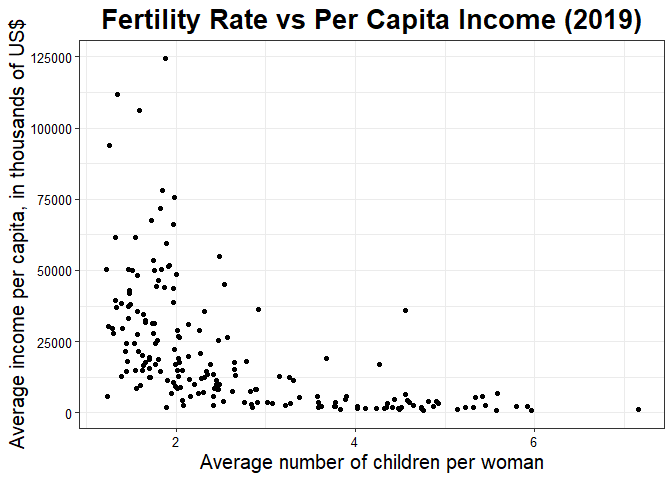

Fertility
================

To analyze outlier cases, we are going to use a dataset with fertility
rates by country, and other fields such as per capita income.

``` r
fertility <- read.csv("tasaFertilidad2019vsGPD.csv")
fertility %>% glimpse()
```

    ## Rows: 189
    ## Columns: 5
    ## $ Pais             <chr> "Afghanistan", "Albania", "Algeria", "Angola", "Antig…
    ## $ Abrev            <chr> "AF", "AL", "DZ", "AO", "AG", "AR", "AM", "AW", "AU",…
    ## $ Continente       <chr> "Asia", "Europe", "Africa", "Africa", "North America"…
    ## $ TasaFertilidad   <dbl> 4.412, 1.705, 2.650, 5.589, 2.034, 2.268, 1.601, 1.79…
    ## $ IngresoPerCapita <int> 2000, 12500, 15200, 6800, 26300, 20900, 9500, 25300, …

## Visual inspection

The first method that we will program is visual inspection, for which we
will use the ggplot library.

<!-- -->

Anomalies can be seen in the graph, but it is a subjective method and
dependent on each analyst.

## Grubb’s univariate test

To use an analytical method, we will apply the Grubb test, which is
implemented in the outliers library.

    ## 
    ##  Grubbs test for one outlier
    ## 
    ## data:  fertility$IngresoPerCapita
    ## G = 4.68872, U = 0.88244, p-value = 0.0001293
    ## alternative hypothesis: highest value 124500 is an outlier

    ## 
    ##  Grubbs test for one outlier
    ## 
    ## data:  fertility$TasaFertilidad
    ## G = 3.50732, U = 0.93422, p-value = 0.03473
    ## alternative hypothesis: highest value 7.153 is an outlier

This method has the limitation that the number of atypical data to be
reviewed must be predefined. In this case, it validates that the maximum
data of both variables have atypical behavior.

## Distance methods

A multivariate alternative to the detection of atypical cases is the
distance method. We will calculate the Mahalanobis distance to consider
the covariances present in the data.

<!-- --><!-- -->

It can be seen that those points furthest from the central cloud have
the greatest distance values, which can be seen in red.

## Nearest neighbors method

This method is based on identifying the neighbors with the shortest
distance to each point, so the same mahalanobis distance can be used,
but the exclusion criterion is more elaborate.

``` r
library(distances)
library(dbscan)

# Calculate mahalanobis distances, using another method available in the distances library
tempDist <- distances(fertility[,c(4,5)],normalize = "mahalanobize") %>% as.dist()

# Preserve the 4 minor distances
temp <- kNNdist(tempDist, 4, all=T)
temp <- temp[,4] # preserve the maximum of the 4 close distances

# Visualize the density of these maximum distances
ggplot(temp %>% as_tibble(), aes(x=temp)) +
  geom_density() +
  theme_bw() +
  theme(text=element_text(size=25))
```

<!-- -->

``` r
# visualize the scatter plot, colored according to maximum distance of knn
ggplot(fertility, aes(x=TasaFertilidad,y=IngresoPerCapita,color=temp)) +
  geom_point(size=1,alpha=0.8)+theme_bw()+
  scale_color_gradient(low="blue",high="red")+
  ggtitle("Fertility Rate vs Per Capita Income (2019)") +  
  theme_bw() +
  theme(plot.title = element_text(size = 20, face="bold", hjust=0.5),
        axis.title = element_text(size = 15),
        axis.text = element_text(size = 10, color="black")) +
  xlab("Average number of children per woman") + 
  ylab("Average income per capita, in thousands of US$")
```

<!-- -->

This analysis allows us to identify atypical data that are isolated but
within the ranges of values of variables.

## Density method

To execute the density method, we will calculate the local outlier
factor, or LOF, implemented in the dbscan library.

``` r
library(dbscan)

## Calculate the lof from mahalanobis distances calculated in the previous step (tempDist)
outlierScores = dbscan::lof(tempDist, k=5)

# Visualize the density of the abnormal scores
ggplot(outlierScores %>% as_tibble(), aes(x= outlierScores)) + 
  geom_density() + 
  theme_bw() + 
  theme(text=element_text(size=18))
```

<!-- -->

``` r
# generate subset of data with high outlier scores
subData=fertility[outlierScores>3,]

# visualize dispersion, colored according to LOF
ggplot(fertility, aes(x = TasaFertilidad, y = IngresoPerCapita, color = outlierScores)) +  
  geom_point(size=1,alpha=0.8) +
  geom_text(data = subData, label = subData$Abrev, color = "blue") +  # visualize the texts (Abrev) of atypical values
  scale_color_gradient(low="blue", high="red")+
  ggtitle("Fertility Rate vs Per Capita Income (2019)") +  
  xlab("Average number of children per woman") + 
  ylab("Average income per capita, in thousands of US$")
```

<!-- -->

According to this analysis, the GQ, IQ and NE points correspond to
atypical values.
