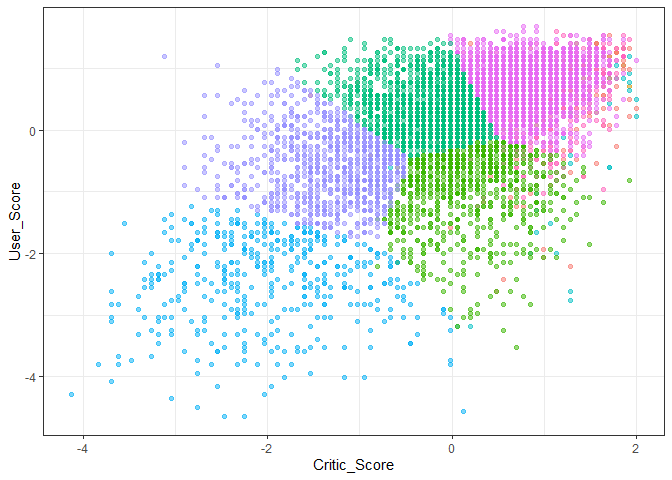
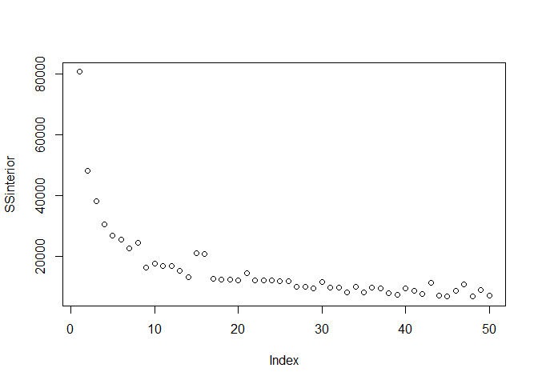
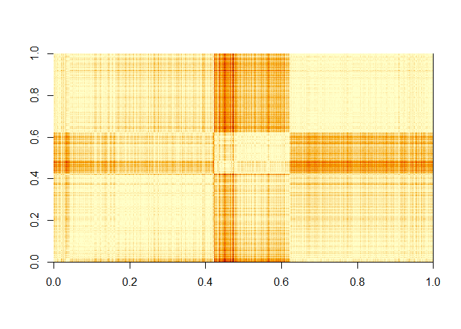
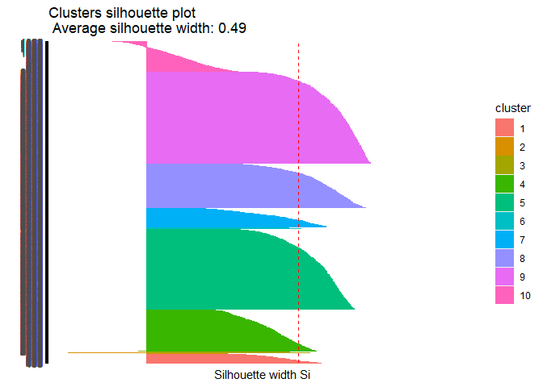
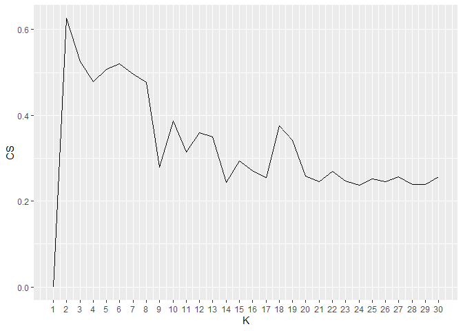

Videogames
================

For the cluster analysis, we are going to analyze video game sales data,
we will take a look at the variables present.

``` r
library(tidyverse)
```

    ## ── Attaching core tidyverse packages ──────────────────────── tidyverse 2.0.0 ──
    ## ✔ dplyr     1.1.2     ✔ readr     2.1.4
    ## ✔ forcats   1.0.0     ✔ stringr   1.5.0
    ## ✔ ggplot2   3.4.2     ✔ tibble    3.2.1
    ## ✔ lubridate 1.9.2     ✔ tidyr     1.3.0
    ## ✔ purrr     1.0.1     
    ## ── Conflicts ────────────────────────────────────────── tidyverse_conflicts() ──
    ## ✖ dplyr::filter() masks stats::filter()
    ## ✖ dplyr::lag()    masks stats::lag()
    ## ℹ Use the conflicted package (<http://conflicted.r-lib.org/>) to force all conflicts to become errors

``` r
videogames  <- read.csv("video_games_sales.csv")

summary(videogames)
```

    ##      Name             Platform         Year_of_Release       Genre          
    ##  Length:16719       Length:16719       Length:16719       Length:16719      
    ##  Class :character   Class :character   Class :character   Class :character  
    ##  Mode  :character   Mode  :character   Mode  :character   Mode  :character  
    ##                                                                             
    ##                                                                             
    ##                                                                             
    ##                                                                             
    ##   Publisher            NA_Sales          EU_Sales         JP_Sales      
    ##  Length:16719       Min.   : 0.0000   Min.   : 0.000   Min.   : 0.0000  
    ##  Class :character   1st Qu.: 0.0000   1st Qu.: 0.000   1st Qu.: 0.0000  
    ##  Mode  :character   Median : 0.0800   Median : 0.020   Median : 0.0000  
    ##                     Mean   : 0.2633   Mean   : 0.145   Mean   : 0.0776  
    ##                     3rd Qu.: 0.2400   3rd Qu.: 0.110   3rd Qu.: 0.0400  
    ##                     Max.   :41.3600   Max.   :28.960   Max.   :10.2200  
    ##                                                                         
    ##   Other_Sales        Global_Sales      Critic_Score    Critic_Count   
    ##  Min.   : 0.00000   Min.   : 0.0100   Min.   :13.00   Min.   :  3.00  
    ##  1st Qu.: 0.00000   1st Qu.: 0.0600   1st Qu.:60.00   1st Qu.: 12.00  
    ##  Median : 0.01000   Median : 0.1700   Median :71.00   Median : 21.00  
    ##  Mean   : 0.04733   Mean   : 0.5335   Mean   :68.97   Mean   : 26.36  
    ##  3rd Qu.: 0.03000   3rd Qu.: 0.4700   3rd Qu.:79.00   3rd Qu.: 36.00  
    ##  Max.   :10.57000   Max.   :82.5300   Max.   :98.00   Max.   :113.00  
    ##                                       NA's   :8582    NA's   :8582    
    ##   User_Score          User_Count       Developer            Rating         
    ##  Length:16719       Min.   :    4.0   Length:16719       Length:16719      
    ##  Class :character   1st Qu.:   10.0   Class :character   Class :character  
    ##  Mode  :character   Median :   24.0   Mode  :character   Mode  :character  
    ##                     Mean   :  162.2                                        
    ##                     3rd Qu.:   81.0                                        
    ##                     Max.   :10665.0                                        
    ##                     NA's   :9129

To cluster, we are going to select the sales variables and evaluate each
videogame. To analyze the behavior we are going to exclude global sales
since it is a variable that is linearly dependent on the rest of the
sales.

Before clustering we must prepare the data:

- Convert User_score to numeric.
- Removing missing data.
- Scale data

``` r
# Convert User_score to numeric
videogames$User_Score <- as.numeric(videogames$User_Score)
```

    ## Warning: NAs introducidos por coerción

``` r
# Removing missing data and Global_Sales
videogames_cleaned <- videogames %>% filter(!(is.na(Critic_Score) | is.na(User_Score))) %>% select(-Global_Sales)

# Scale data
videogames_num <- videogames_cleaned[,c(6:9, 10, 12)]
videogames_scaled = scale(videogames_num) %>% as_tibble()
videogames_scaled %>% summary()
```

    ##     NA_Sales           EU_Sales          JP_Sales        Other_Sales      
    ##  Min.   :-0.40676   Min.   :-0.3432   Min.   :-0.2215   Min.   :-0.30580  
    ##  1st Qu.:-0.34407   1st Qu.:-0.3137   1st Qu.:-0.2215   1st Qu.:-0.26829  
    ##  Median :-0.25003   Median :-0.2549   Median :-0.2215   Median :-0.23078  
    ##  Mean   : 0.00000   Mean   : 0.0000   Mean   : 0.0000   Mean   : 0.00000  
    ##  3rd Qu.: 0.00074   3rd Qu.:-0.0340   3rd Qu.:-0.1863   3rd Qu.:-0.04323  
    ##  Max.   :42.80933   Max.   :42.2946   Max.   :22.6528   Max.   :39.34256  
    ##   Critic_Score       User_Score     
    ##  Min.   :-4.1244   Min.   :-4.6366  
    ##  1st Qu.:-0.5943   1st Qu.:-0.4735  
    ##  Median : 0.1261   Median : 0.2203  
    ##  Mean   : 0.0000   Mean   : 0.0000  
    ##  3rd Qu.: 0.7024   3rd Qu.: 0.7060  
    ##  Max.   : 1.9992   Max.   : 1.6774

## Kmeans

We already have the data scaled, we are going to apply the kmeans
algorithm, which is implemented in R base.

To test, let’s apply kmeans with k = 10

``` r
kmeans_model <- kmeans(videogames_scaled, centers = 10)

# create the cluster variable in the videogames_scaled table
videogames_scaled$clus <- kmeans_model$cluster %>% as.factor()

ggplot(videogames_scaled, aes(Critic_Score, User_Score, color=clus)) +
  geom_point(alpha=0.5, show.legend = F) +
  theme_bw()
```

<!-- -->

### Intra-cluster Sum of Squares (SSE)

Let’s see how the intra-cluster sum of squares evolves as we increase
the number of k

``` r
SSinterior <- numeric(50)

for(k in 1:50){
  model <- kmeans(videogames_scaled, centers = k)
  SSinterior[k] <- model$tot.withinss
}

plot(SSinterior)
```

<!-- -->

## Evaluation

There are various methods for evaluating the quality of the resulting
clusters.

### Visual Inspection

take distance matrices. Sort them according to clusters, rows and
columns and display the matrix as image.

``` r
# use euclidean distance
tempDist <- dist(videogames_num) %>% as.matrix()

# reorder rows and columns based on the cluster obtained
index <- sort(kmeans_model$cluster, index.return=TRUE)
tempDist <- tempDist[index$ix,index$ix]
rownames(tempDist) <- c(1:nrow(videogames_cleaned))
colnames(tempDist) <- c(1:nrow(videogames_cleaned))

image(tempDist)
```

<!-- -->

### Hopkins Statistic

The Hopkins statistic is a measure used in clustering analysis to
evaluate the grouping of data. It is used to determine whether a data
set has a clustered structure or whether the data points are randomly
distributed.

When to use the Hopkins statistic:

You should use the Hopkins statistic when you want to evaluate whether
your data is suitable for applying clustering algorithms, such as
k-means, or whether there is an inherent clustering structure in your
data. This is especially useful in situations where you have no prior
information about the grouping structure of your data and want to
determine whether clustering is appropriate.

How to interpret the Hopkins statistic:

The Hopkins statistic varies in the range from 0 to 1, where:

- Close to 0: Indicates that the data is more evenly distributed and is
  less likely to have a significant clustering structure.
- Close to 1: Indicates that the data has a significant clustering
  structure and is suitable for applying clustering algorithms.

The general interpretation is that the closer the value of the Hopkins
statistic is to 1, the greater the probability that your data has a
clustering structure. On the other hand, if the value is close to 0, it
is more likely that the data is evenly distributed and there is no clear
clustering structure.

The precise interpretation may vary depending on the context and
specific application. A typical reference value is 0.5; If the Hopkins
statistic is much greater than 0.5, it suggests a clustering structure,
while if it is much less than 0.5, it suggests a more uniform
distribution.

``` r
library(factoextra)

res <- get_clust_tendency(videogames_num, n = 30, graph = FALSE)

print(res)
```

    ## $hopkins_stat
    ## [1] 0.9921878
    ## 
    ## $plot
    ## NULL

### Correlation Index

Is used to measure the relationship between two variables in a data set.
It can be the Pearson correlation coefficient (which measures linear
correlation) or the Spearman correlation coefficient (which measures
monotonic correlation).

The correlation index varies between -1 and 1:

- If it is close to 1, it indicates a strong positive correlation
  between the variables (as one increases, the other also tends to
  increase).
- If it is close to -1, it indicates a strong negative correlation (as
  one increases, the other tends to decrease).
- If it is close to 0, it indicates a weak or non-existent correlation
  between the variables.

The correlation index is used to understand the relationship between two
variables and can help make data-driven decisions, identify patterns,
and predict behaviors.

``` r
# Correlation
# build an ideal correlation matrix (each entity correlates 1 with its cluster)
tempMatrix <- matrix(0, nrow = nrow(videogames_scaled), ncol = nrow(videogames_scaled))
tempMatrix[which(index$x==1), which(index$x==1)]  <- 1
tempMatrix[which(index$x==2), which(index$x==2)]  <- 1
tempMatrix[which(index$x==3), which(index$x==3)]  <- 1
tempMatrix[which(index$x==4), which(index$x==4)]  <- 1
tempMatrix[which(index$x==5), which(index$x==5)]  <- 1
tempMatrix[which(index$x==6), which(index$x==6)]  <- 1
tempMatrix[which(index$x==7), which(index$x==7)]  <- 1
tempMatrix[which(index$x==8), which(index$x==8)]  <- 1
tempMatrix[which(index$x==9), which(index$x==9)]  <- 1
tempMatrix[which(index$x==10), which(index$x==10)] <- 1

# construct dissimilarity matrix
tempDist2 <- 1/(1+tempDist)

# Calculate correlation 
cor <- cor(tempMatrix[upper.tri(tempMatrix)],tempDist2[upper.tri(tempDist2)])

print(cor)
```

    ## [1] 0.4190692

### Cohesion and separation index

Cohesion and separation indices are measures used in the context of
clustering analysis to evaluate the quality of groups formed by a
clustering algorithm. Below I provide a brief description of each one:

Cohesion Index: This index measures how close the points are within the
same group or cluster. The higher the cohesion index, the better the
cohesion within groups, meaning that points within the same group are
closer to each other. High cohesion is desired in clustering, since it
indicates that the points in a group are similar to each other.

Separation Index: This index measures how far points are from different
groups or clusters. The higher the separation index, the better the
separation between the groups, meaning that the groups are well
differentiated and do not overlap with each other. High separation is
desired in clustering, as it indicates that the groups are distinct and
easily distinguishable.

These indices are used to evaluate the quality of the clustering
results. In general, we seek to maximize the cohesion index and minimize
the separation index to obtain cohesive and well-separated groups.
However, choosing a clustering algorithm and interpreting these indices
may depend on the specific nature of your data and your analysis
objectives.

``` r
library(flexclust) # usaremos la distancia implementada en flexclus (dist2) que maneja mejor objetos de diferente tamaño
data_escala <- apply(videogames_scaled,2,as.numeric)
 
#Cohesion
withinCluster <- numeric(10)
for (i in 1:10){
  tempData <- data_escala[which(kmeans_model$cluster == i),]
  withinCluster[i] <- sum(dist2(tempData,colMeans(tempData))^2)
}
cohesion = sum(withinCluster)
#es equivalente a model$tot.withinss en k-means
print(c(cohesion, kmeans_model$tot.withinss))
```

    ## [1] 12569.54 12569.54

``` r
#Separation
meanData <- colMeans(data_escala)
SSB <- numeric(10)
for (i in 1:10){
  tempData <- data_escala[which(kmeans_model$cluster==i),]
  SSB[i] <- nrow(tempData)*sum((meanData-colMeans(tempData))^2)
}
separation = sum(SSB)

print(separation)
```

    ## [1] 68174.33

### Silhouette Coefficient

The silhouette coefficient (silhouette coefficient in English) is
another measure used to evaluate the quality of the groups formed by a
clustering algorithm. Provides a score that indicates how similar each
data object is to its own group (cohesion) compared to other groups
(separation). It is a metric that varies between -1 and 1, where:

- A value close to 1 indicates that the object is well within its own
  group and far from other groups, suggesting that grouping is
  appropriate.
- A value close to 0 indicates that the object is near the boundary
  between two groups or could be on a boundary between groups.
- A value close to -1 indicates that the object might have been
  incorrectly assigned to one group and would be closer to another
  group.

``` r
library(cluster)

coefSil <- silhouette(kmeans_model$cluster,dist(videogames_scaled))
summary(coefSil)
```

    ## Silhouette of 7017 units in 10 clusters from silhouette.default(x = kmeans_model$cluster, dist = dist(videogames_scaled)) :
    ##  Cluster sizes and average silhouette widths:
    ##          214           13           35          919         1757           34 
    ## 0.4130746864 0.0007172354 0.3131559886 0.3919190725 0.5439416387 0.3419479378 
    ##          420          974         2000          651 
    ## 0.4072057340 0.5527109305 0.6079823900 0.0998634846 
    ## Individual silhouette widths:
    ##    Min. 1st Qu.  Median    Mean 3rd Qu.    Max. 
    ## -0.2527  0.4053  0.5320  0.4870  0.6205  0.7201

``` r
#visualizamos el codigo de silueta de cada cluster
fviz_silhouette(coefSil) + coord_flip()
```

    ##    cluster size ave.sil.width
    ## 1        1  214          0.41
    ## 2        2   13          0.00
    ## 3        3   35          0.31
    ## 4        4  919          0.39
    ## 5        5 1757          0.54
    ## 6        6   34          0.34
    ## 7        7  420          0.41
    ## 8        8  974          0.55
    ## 9        9 2000          0.61
    ## 10      10  651          0.10

<!-- -->

We use the silhouette coefficient to find the best value of K

``` r
coefSil=numeric(30)
for (k in 2:30){
  modelo <- kmeans(videogames_scaled, centers = k)
  temp <- silhouette(modelo$cluster,dist(videogames_scaled))
  coefSil[k] <- mean(temp[,3])
}
tempDF=data.frame(CS=coefSil,K=c(1:30))

ggplot(tempDF, aes(x=K, y=CS)) + 
  geom_line() +
  scale_x_continuous(breaks=c(1:30))
```

<!-- -->
