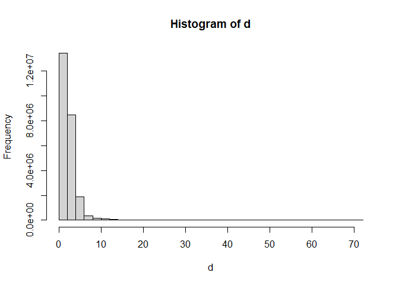
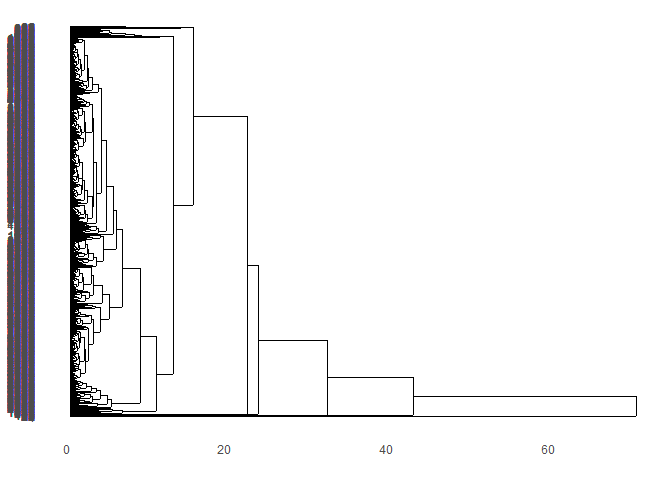
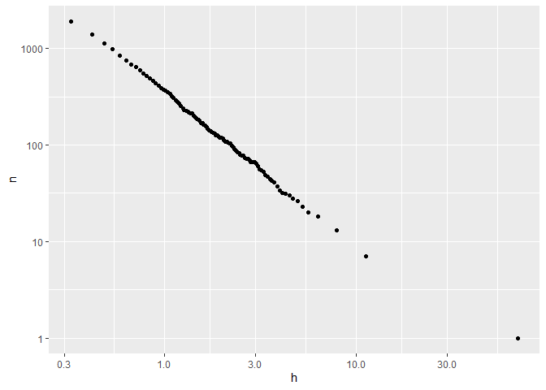

Videogames_Hierarchical
================

In this example we will use the same data as for k means

``` r
library(tidyverse)

data_escalada  <- read.csv("video_games_sales.csv") %>% 
  mutate(User_Score = as.numeric(User_Score)) %>% 
  filter(!(is.na(Critic_Score) | is.na(User_Score))) %>% 
  select(-Global_Sales) %>% 
  select(c(6:9, 10, 12)) %>% 
  scale() %>% 
  as_tibble()

data_escalada %>% head()
```

    ## # A tibble: 6 × 6
    ##   NA_Sales EU_Sales JP_Sales Other_Sales Critic_Score User_Score
    ##      <dbl>    <dbl>    <dbl>       <dbl>        <dbl>      <dbl>
    ## 1     42.8    42.3      13.0       31.4         0.414      0.567
    ## 2     16.0    18.4      13.1       12.0         0.847      0.775
    ## 3     15.9    15.7      11.3       10.8         0.702      0.567
    ## 4     11.4    13.1      22.7       10.5         1.35       0.914
    ## 5     14.2    13.2      10.1       10.3        -0.883     -0.404
    ## 6     14.7     9.87     16.3        8.10        1.21       0.845

Now we calculate the distance matrix between the entities, using the
‘dist’ function that calculates the Euclidean distances

``` r
# Euclidean distance
d = dist(data_escalada)

hist(d)
```

<!-- -->

Using the R base hclust function, we apply hierarchical clustering,
based on the distance matrix d, and use the complete linkage criterion.

``` r
model_complete = hclust(d, method="complete") 

summary(model_complete)
```

    ##             Length Class  Mode     
    ## merge       14032  -none- numeric  
    ## height       7016  -none- numeric  
    ## order        7017  -none- numeric  
    ## labels          0  -none- NULL     
    ## method          1  -none- character
    ## call            3  -none- call     
    ## dist.method     1  -none- character

We generate a dendrogram to visualize the hierarchy. The ‘ggdendro’
library allows you to make these diagrams in a syntax equivalent to
ggplot.

``` r
library("ggdendro")

ggdendrogram(model_complete, rotate = TRUE, theme_dendro = TRUE) 
```

<!-- -->

The ‘hclust’ function has the ‘method’ parameter, which can be set with
different joining criteria, such as ‘average linkage’ or others.

``` r
model_ward = hclust(d, method="ward.D") 
model_ward2 = hclust(d, method="ward.D2") 
model_single = hclust(d, method="single")
model_average = hclust(d, method="average") 
model_mcquitty = hclust(d, method="mcquitty") 
model_median = hclust(d, method="median") 
model_centroid = hclust(d, method="centroid") 

summary(model_ward)
```

    ##             Length Class  Mode     
    ## merge       14032  -none- numeric  
    ## height       7016  -none- numeric  
    ## order        7017  -none- numeric  
    ## labels          0  -none- NULL     
    ## method          1  -none- character
    ## call            3  -none- call     
    ## dist.method     1  -none- character

``` r
summary(model_ward2)
```

    ##             Length Class  Mode     
    ## merge       14032  -none- numeric  
    ## height       7016  -none- numeric  
    ## order        7017  -none- numeric  
    ## labels          0  -none- NULL     
    ## method          1  -none- character
    ## call            3  -none- call     
    ## dist.method     1  -none- character

``` r
summary(model_single)
```

    ##             Length Class  Mode     
    ## merge       14032  -none- numeric  
    ## height       7016  -none- numeric  
    ## order        7017  -none- numeric  
    ## labels          0  -none- NULL     
    ## method          1  -none- character
    ## call            3  -none- call     
    ## dist.method     1  -none- character

``` r
summary(model_average)
```

    ##             Length Class  Mode     
    ## merge       14032  -none- numeric  
    ## height       7016  -none- numeric  
    ## order        7017  -none- numeric  
    ## labels          0  -none- NULL     
    ## method          1  -none- character
    ## call            3  -none- call     
    ## dist.method     1  -none- character

``` r
summary(model_mcquitty)
```

    ##             Length Class  Mode     
    ## merge       14032  -none- numeric  
    ## height       7016  -none- numeric  
    ## order        7017  -none- numeric  
    ## labels          0  -none- NULL     
    ## method          1  -none- character
    ## call            3  -none- call     
    ## dist.method     1  -none- character

``` r
summary(model_median)
```

    ##             Length Class  Mode     
    ## merge       14032  -none- numeric  
    ## height       7016  -none- numeric  
    ## order        7017  -none- numeric  
    ## labels          0  -none- NULL     
    ## method          1  -none- character
    ## call            3  -none- call     
    ## dist.method     1  -none- character

``` r
summary(model_centroid)
```

    ##             Length Class  Mode     
    ## merge       14032  -none- numeric  
    ## height       7016  -none- numeric  
    ## order        7017  -none- numeric  
    ## labels          0  -none- NULL     
    ## method          1  -none- character
    ## call            3  -none- call     
    ## dist.method     1  -none- character

Trees can be cut at some point according to the height parameter ‘h’. We
are going to make a cut with ‘h = 5’ and we will see how many clusters
we get, and their silhouettes.

``` r
library(cluster)

groups <- cutree(model_complete, h = 5)  
coefsil <- silhouette(groups, d)
groups %>% unique() %>% length()
```

    ## [1] 40

``` r
summary(coefsil)
```

    ## Silhouette of 7017 units in 40 clusters from silhouette.default(x = groups, dist = d) :
    ##  Cluster sizes and average silhouette widths:
    ##          1          2          1          1          1          2          1 
    ## 0.00000000 0.29235088 0.00000000 0.00000000 0.00000000 0.44872575 0.00000000 
    ##          1          1          1          1          7          2          2 
    ## 0.00000000 0.00000000 0.00000000 0.00000000 0.28054179 0.51019608 0.22390074 
    ##          7          7          8          1          6          2          5 
    ## 0.24101470 0.14600825 0.45245350 0.00000000 0.08551175 0.17371337 0.51938606 
    ##          5          9          2         27         24         98          8 
    ## 0.33172113 0.32694115 0.47063658 0.28825650 0.26936865 0.07614205 0.30351831 
    ##          1         13         27          7       3545         54          2 
    ## 0.00000000 0.19224519 0.11404962 0.03957960 0.31410998 0.39038585 0.35801562 
    ##        585       2018        510         17          5 
    ## 0.17618123 0.23799073 0.30506978 0.56306525 0.51491921 
    ## Individual silhouette widths:
    ##    Min. 1st Qu.  Median    Mean 3rd Qu.    Max. 
    ## -0.5668  0.1443  0.3208  0.2760  0.4462  0.6685

We will use the number of clusters to compare different cut-off points
of the hierarchy.

``` r
res <- tibble("h" = quantile(d, probs  = (1:100)/100), n = 0)

for (i in 1:100){
  groups <- cutree(model_average, h = res$h[i])  
  res$n[i] <- groups %>% unique() %>% length()
}  

ggplot(res, aes(h, n)) + 
  geom_point() + 
  scale_x_log10() + 
  scale_y_log10()
```

<!-- -->
