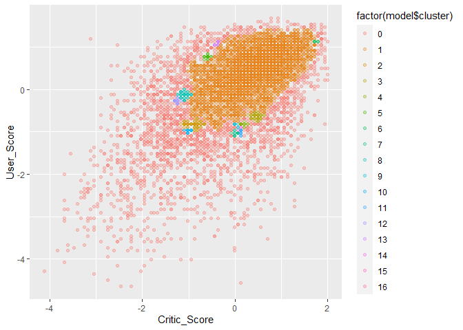

Videogames_Probabilistic
================

For this exercise we will continue using the video game data that we
have used in previous sessions, but we will only use the User Score and
Critic Score variables to better visualize the results in a 2D graph.

``` r
library(tidyverse)

data_escalada  <- read.csv("video_games_sales.csv") %>% 
  mutate(User_Score = as.numeric(User_Score)) %>% 
  filter(!(is.na(Critic_Score) | is.na(User_Score))) %>% 
  select(-Global_Sales) %>% 
  select(Critic_Score, User_Score) %>% 
  scale() %>% 
  as_tibble()

data_escalada %>% summary()
```

    ##   Critic_Score       User_Score     
    ##  Min.   :-4.1244   Min.   :-4.6366  
    ##  1st Qu.:-0.5943   1st Qu.:-0.4735  
    ##  Median : 0.1261   Median : 0.2203  
    ##  Mean   : 0.0000   Mean   : 0.0000  
    ##  3rd Qu.: 0.7024   3rd Qu.: 0.7060  
    ##  Max.   : 1.9992   Max.   : 1.6774

## Density-based Clustering

The first method that we will implement is density-based clustering,
which is implemented in the DBSCAN library.

``` r
library(dbscan)

model = dbscan(data_escalada, eps = 0.1, minPts = 15)

model
```

    ## DBSCAN clustering for 7017 objects.
    ## Parameters: eps = 0.1, minPts = 15
    ## Using euclidean distances and borderpoints = TRUE
    ## The clustering contains 16 cluster(s) and 2020 noise points.
    ## 
    ##    0    1    2    3    4    5    6    7    8    9   10   11   12   13   14   15 
    ## 2020 4732   68   44   15   17    5   15   38    7   16   10   15   11    2    1 
    ##   16 
    ##    1 
    ## 
    ## Available fields: cluster, eps, minPts, dist, borderPoints

It can be seen that the model generated 16 clusters based on the minPts
and eps parameters that we gave to the dbscan function.

In the figure below we can see that the clusters are distributed
throughout space

``` r
ggplot(data_escalada, aes(Critic_Score, User_Score, color = factor(model$cluster))) + 
  geom_point(alpha = 0.3) 
```

<!-- -->

It can be seen that there are several points that are not assigned to
any cluster given the values chosen for the minimum distance.

## C-means Algorithm

Other algorithms such as c-means allow you to assign a cluster to all
points.

To apply cmeans we will use a library called e1071, although there are
other implementations

``` r
library(e1071)

modelo_c_means <- cmeans(data_escalada, 16, m=3) 

modelo_c_means$membership %>% head()
```

    ##               1          2          3          4          5          6
    ## [1,] 0.05475523 0.09020523 0.03917938 0.02697814 0.06453425 0.02573659
    ## [2,] 0.03780232 0.07527690 0.02872065 0.02329548 0.03874463 0.02107180
    ## [3,] 0.05029339 0.12939255 0.03540795 0.02785088 0.04933291 0.02470678
    ## [4,] 0.02115153 0.03534785 0.01688620 0.01510298 0.02060078 0.01326875
    ## [5,] 0.04847587 0.03063998 0.08413402 0.04933341 0.05113581 0.31108718
    ## [6,] 0.03769505 0.06735696 0.02953326 0.02592670 0.03675702 0.02277841
    ##               7          8           9         10          11         12
    ## [1,] 0.01779537 0.25062935 0.009655959 0.15684398 0.013584218 0.04047246
    ## [2,] 0.01561652 0.06951950 0.009255685 0.07409979 0.012517878 0.08270774
    ## [3,] 0.01764109 0.11378614 0.010109812 0.09163728 0.013948574 0.05971513
    ## [4,] 0.01031646 0.02978974 0.006580270 0.03066980 0.008609444 0.64575387
    ## [5,] 0.08069924 0.03536541 0.020048570 0.03164400 0.037083346 0.02010296
    ## [6,] 0.01745640 0.05589424 0.010915039 0.05722953 0.014424732 0.31805798
    ##              13         14         15         16
    ## [1,] 0.08031804 0.03309623 0.07787663 0.01833894
    ## [2,] 0.19396685 0.02523028 0.27586775 0.01630621
    ## [3,] 0.20674104 0.02960942 0.12118534 0.01864170
    ## [4,] 0.06005454 0.01508042 0.05988207 0.01090530
    ## [5,] 0.02556741 0.08906325 0.02446715 0.06115238
    ## [6,] 0.13364840 0.02613801 0.12773712 0.01845116

The c means algorithm assigns as a cluster the one with the highest
probability

``` r
ggplot(data_escalada, aes(Critic_Score, User_Score, color = factor(modelo_c_means$cluster))) + 
  geom_point(alpha = 0.3) 
```

<!-- -->

## Fuzzy Partition Coefficient (FPC)

For fuzzy clustering models we can calculate the Fuzzy Partition
Coefficient (FPC)

``` r
matriz <- modelo_c_means$membership%*%t(modelo_c_means$membership) # producto matricial

(FPC <- sum(matriz*diag(nrow(matriz)))/nrow(matriz))
```

    ## [1] 0.1275592

The FPC value is low, which means that the groups have high variability,
and it can be confirmed in the figure since no defined groups are seen.

As in cmeans, GMM methods allow obtaining fuzzy clusters but using
probabilistic models.

To apply GMM, we use the mclust library

``` r
library(mclust)

model_gmm = Mclust(data_escalada)

model_gmm 
```

    ## 'Mclust' model object: (VEI,5) 
    ## 
    ## Available components: 
    ##  [1] "call"           "data"           "modelName"      "n"             
    ##  [5] "d"              "G"              "BIC"            "loglik"        
    ##  [9] "df"             "bic"            "icl"            "hypvol"        
    ## [13] "parameters"     "z"              "classification" "uncertainty"

``` r
summary(model_gmm, parameters = TRUE)
```

    ## ---------------------------------------------------- 
    ## Gaussian finite mixture model fitted by EM algorithm 
    ## ---------------------------------------------------- 
    ## 
    ## Mclust VEI (diagonal, equal shape) model with 5 components: 
    ## 
    ##  log-likelihood    n df       BIC       ICL
    ##       -17049.73 7017 20 -34276.58 -39067.65
    ## 
    ## Clustering table:
    ##    1    2    3    4    5 
    ## 2463  322 1901 1916  415 
    ## 
    ## Mixing probabilities:
    ##          1          2          3          4          5 
    ## 0.34182541 0.04702986 0.24001517 0.30374889 0.06738068 
    ## 
    ## Means:
    ##                    [,1]     [,2]      [,3]       [,4]      [,5]
    ## Critic_Score 0.09092997 1.402430 0.7512725 -0.5340601 -1.708723
    ## User_Score   0.29314546 1.089748 0.7442146 -0.5689574 -2.333872
    ## 
    ## Variances:
    ## [,,1]
    ##              Critic_Score User_Score
    ## Critic_Score    0.3710258  0.0000000
    ## User_Score      0.0000000  0.2407341
    ## [,,2]
    ##              Critic_Score User_Score
    ## Critic_Score   0.07004714 0.00000000
    ## User_Score     0.00000000 0.04544895
    ## [,,3]
    ##              Critic_Score User_Score
    ## Critic_Score    0.1671814   0.000000
    ## User_Score      0.0000000   0.108473
    ## [,,4]
    ##              Critic_Score User_Score
    ## Critic_Score    0.8004943  0.0000000
    ## User_Score      0.0000000  0.5193878
    ## [,,5]
    ##              Critic_Score User_Score
    ## Critic_Score      1.08692  0.0000000
    ## User_Score        0.00000  0.7052308

The model generated 5 clusters which can be viewed the same as the
previous examples.

``` r
ggplot(data_escalada) + 
  aes(x=Critic_Score, y=User_Score, color=factor(model_gmm$classification)) + 
  geom_point(alpha=0.5) 
```

<!-- -->

The model applied all possible forms of the covariance matrix, and
allows us to visualize how the BIC evolves as we increase the number of
clusters.

This visualization allows us to see that most of the models stop
improving after 5 clusters.

``` r
plot(model_gmm, what = "BIC")
```

<!-- -->
