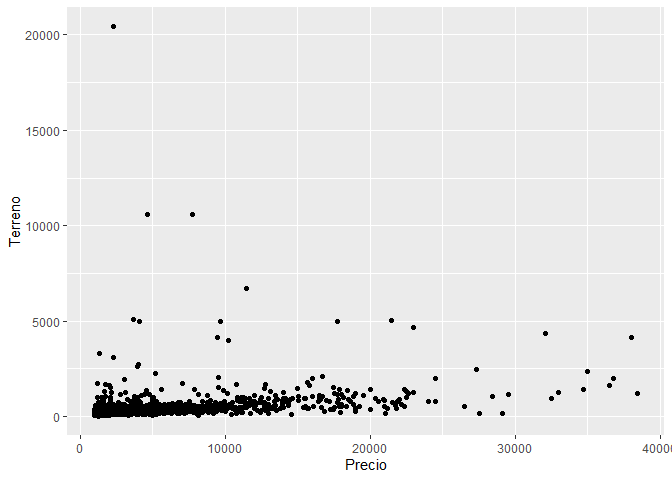
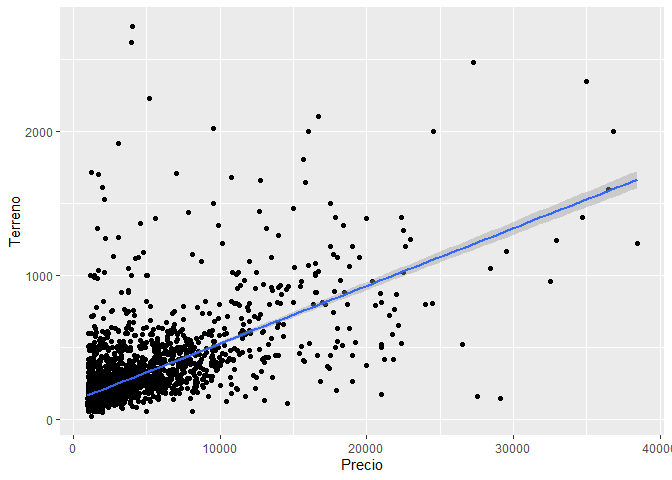
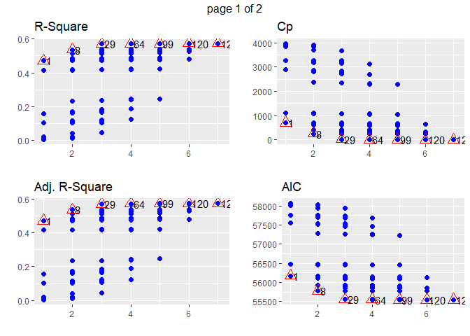
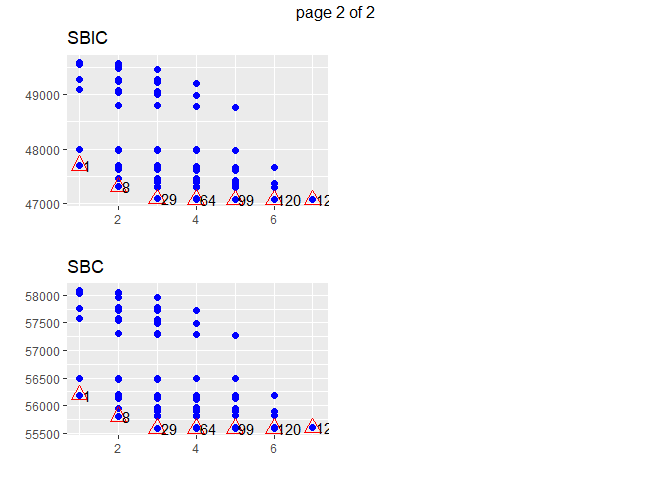

Properties
================

For the regression analysis we are going to use data on housing prices
in Santiago, Chile.

The first thing we will do is load the data and review it with the
summary function

``` r
library(tidyverse)

propiedades <- read_csv("propiedades.csv")

summary(propiedades)
```

    ##      Precio         Terreno          Construido     Año_Construccion
    ##  Min.   : 1001   Min.   :   26.0   Min.   :   7.0   Min.   :1900    
    ##  1st Qu.: 1394   1st Qu.:  134.0   1st Qu.:  65.0   1st Qu.:1979    
    ##  Median : 2002   Median :  190.0   Median :  88.0   Median :1996    
    ##  Mean   : 3635   Mean   :  303.9   Mean   : 108.9   Mean   :1990    
    ##  3rd Qu.: 3964   3rd Qu.:  300.0   3rd Qu.: 128.0   3rd Qu.:2005    
    ##  Max.   :38424   Max.   :20427.0   Max.   :1411.0   Max.   :2013    
    ##  densidad_barrio      colegio_15m        jardin_15m      trabajo_15m   
    ##  Min.   :   0.0384   Min.   :0.00000   Min.   :0.0000   Min.   :0.000  
    ##  1st Qu.:  62.4307   1st Qu.:0.00000   1st Qu.:1.0000   1st Qu.:0.000  
    ##  Median : 118.9393   Median :0.00000   Median :1.0000   Median :0.000  
    ##  Mean   : 132.7480   Mean   :0.07833   Mean   :0.8487   Mean   :0.023  
    ##  3rd Qu.: 186.7929   3rd Qu.:0.00000   3rd Qu.:1.0000   3rd Qu.:0.000  
    ##  Max.   :1305.9717   Max.   :1.00000   Max.   :1.0000   Max.   :1.000

We see that in the database there are columns for the Price of the
homes, as well as the surface area of the land, constructed area, year
of construction, and some variables related to the neighborhood, such as
housing density of the neighborhood, and the presence of schools,
gardens or workplaces within a 15-minute walk from the location of the
house.

To begin, we will look for a linear relationship between the price of
the house and the meters built. Before running the regression we will
inspect the data.

## Linear Relationship

``` r
ggplot(propiedades, aes(Precio, Terreno)) + 
  geom_point()
```

<!-- -->

We can see that there are some atypical data that do not reflect the
expected behavior of the market. Given this, we are going to exclude
them from the analysis.

``` r
propiedades <- propiedades %>% filter(Terreno < 3000)

ggplot(propiedades, aes(Precio, Terreno)) + 
  geom_point() +
  geom_smooth(method = "lm")
```

    ## `geom_smooth()` using formula = 'y ~ x'

<!-- -->

## Regression model

### Regression linear model

Now we will execute the regression with the indicated variables using
the lm (linear model) function, which comes in R base.

``` r
regresion_lineal <- lm(Precio~Terreno, propiedades)

summary(regresion_lineal)
```

    ## 
    ## Call:
    ## lm(formula = Precio ~ Terreno, data = propiedades)
    ## 
    ## Residuals:
    ##      Min       1Q   Median       3Q      Max 
    ## -25014.3  -1072.1   -489.3    346.6  26789.5 
    ## 
    ## Coefficients:
    ##             Estimate Std. Error t value Pr(>|t|)    
    ## (Intercept) 770.7969    83.6095   9.219   <2e-16 ***
    ## Terreno      10.3715     0.2254  46.018   <2e-16 ***
    ## ---
    ## Signif. codes:  0 '***' 0.001 '**' 0.01 '*' 0.05 '.' 0.1 ' ' 1
    ## 
    ## Residual standard error: 3111 on 2982 degrees of freedom
    ## Multiple R-squared:  0.4153, Adjusted R-squared:  0.4151 
    ## F-statistic:  2118 on 1 and 2982 DF,  p-value: < 2.2e-16

The results of the regression indicate that the parameter values are 770
for the intercept and 10 for the coefficient associated with the land
surface variable.

It can also be seen that the determination coefficient R2 is .41, which
means that 41% of the price variance is explained by the linear model.

The linear regression method also allows us to obtain the standard
deviations of the parameters, and therefore the t-student statistic and
the p value can be calculated. In the summary table you can see that
both parameters have a statistical significance of 100%, which means
that they really contribute to the explanation of the price.

### Regression logarithmic model

It may happen that the relationship between both variables has a
logarithmic behavior instead of linear, so we are going to test this
hypothesis by applying natural logarithm in both variables.

``` r
regresion_log <- lm(log(Precio)~log(Terreno), propiedades)

summary(regresion_log)
```

    ## 
    ## Call:
    ## lm(formula = log(Precio) ~ log(Terreno), data = propiedades)
    ## 
    ## Residuals:
    ##      Min       1Q   Median       3Q      Max 
    ## -2.44462 -0.34656 -0.00447  0.31638  2.73934 
    ## 
    ## Coefficients:
    ##              Estimate Std. Error t value Pr(>|t|)    
    ## (Intercept)   3.39667    0.08548   39.74   <2e-16 ***
    ## log(Terreno)  0.82685    0.01583   52.25   <2e-16 ***
    ## ---
    ## Signif. codes:  0 '***' 0.001 '**' 0.01 '*' 0.05 '.' 0.1 ' ' 1
    ## 
    ## Residual standard error: 0.545 on 2982 degrees of freedom
    ## Multiple R-squared:  0.4779, Adjusted R-squared:  0.4778 
    ## F-statistic:  2730 on 1 and 2982 DF,  p-value: < 2.2e-16

We can see that the coefficient of determination improved to 47% and
that both coefficients are still statistically significant, which means
that this is a better model than the previous one.

### Regression Polynomial model

It is also possible that the relationship between both variables has a
polynomial form. Let’s try a polynomial of order 3.

``` r
propiedades$Terreno2 <- propiedades$Terreno^2
propiedades$Terreno3 <- propiedades$Terreno^3

regresion_poli <- lm(log(Precio) ~ Terreno + Terreno2 + Terreno3, propiedades)

summary(regresion_poli)
```

    ## 
    ## Call:
    ## lm(formula = log(Precio) ~ Terreno + Terreno2 + Terreno3, data = propiedades)
    ## 
    ## Residuals:
    ##      Min       1Q   Median       3Q      Max 
    ## -2.18588 -0.33243 -0.01676  0.30433  2.77481 
    ## 
    ## Coefficients:
    ##               Estimate Std. Error t value Pr(>|t|)    
    ## (Intercept)  6.783e+00  2.908e-02 233.260   <2e-16 ***
    ## Terreno      5.333e-03  1.799e-04  29.641   <2e-16 ***
    ## Terreno2    -3.620e-06  2.371e-07 -15.266   <2e-16 ***
    ## Terreno3     7.499e-10  7.622e-11   9.839   <2e-16 ***
    ## ---
    ## Signif. codes:  0 '***' 0.001 '**' 0.01 '*' 0.05 '.' 0.1 ' ' 1
    ## 
    ## Residual standard error: 0.5408 on 2980 degrees of freedom
    ## Multiple R-squared:  0.4863, Adjusted R-squared:  0.4858 
    ## F-statistic: 940.4 on 3 and 2980 DF,  p-value: < 2.2e-16

It can be seen that the polynomial regression has a better R2
coefficient than the original model, and that all the coefficients are
still statistically significant.

### Regression multiple linear model

So far we have only tested with one variable, let’s see if we include
the rest of the variables present in the database.

``` r
regresion_multi <- lm(Precio ~ Terreno+Construido+Año_Construccion+densidad_barrio+colegio_15m + jardin_15m + trabajo_15m , propiedades)

summary(regresion_multi)
```

    ## 
    ## Call:
    ## lm(formula = Precio ~ Terreno + Construido + Año_Construccion + 
    ##     densidad_barrio + colegio_15m + jardin_15m + trabajo_15m, 
    ##     data = propiedades)
    ## 
    ## Residuals:
    ##      Min       1Q   Median       3Q      Max 
    ## -22273.2   -821.1   -192.0    342.8  27683.7 
    ## 
    ## Coefficients:
    ##                    Estimate Std. Error t value Pr(>|t|)    
    ## (Intercept)       285.36614 5483.07374   0.052  0.95850    
    ## Terreno             4.85373    0.27070  17.930  < 2e-16 ***
    ## Construido         22.15884    0.86965  25.480  < 2e-16 ***
    ## Año_Construccion   -0.05872    2.72728  -0.022  0.98282    
    ## densidad_barrio    -1.68597    0.59040  -2.856  0.00432 ** 
    ## colegio_15m      2970.93771  192.27722  15.451  < 2e-16 ***
    ## jardin_15m       -369.39854  151.86707  -2.432  0.01506 *  
    ## trabajo_15m       762.48365  326.30383   2.337  0.01952 *  
    ## ---
    ## Signif. codes:  0 '***' 0.001 '**' 0.01 '*' 0.05 '.' 0.1 ' ' 1
    ## 
    ## Residual standard error: 2660 on 2976 degrees of freedom
    ## Multiple R-squared:  0.5733, Adjusted R-squared:  0.5723 
    ## F-statistic: 571.3 on 7 and 2976 DF,  p-value: < 2.2e-16

It can be seen that the multiple linear model has a determination
coefficient of 57%, and that there are some variables that have
statistical significance of less than 99%, and there are even variables
that are not relevant in this model, such as the year of construction.

This does not mean that the year is not relevant, but that it is not
relevant in THIS MODEL.

## Other Methods

Now we are going to try different methods to determine which is the best
combination of variables for the linear model.

The model determination methods are implemented in the olsrr library,
and the first method we will try is brute force.

### Brute Force Method

``` r
library(olsrr)

fuerza_bruta <- ols_step_all_possible(regresion_multi)

plot(fuerza_bruta)
```

<!-- --><!-- -->

### Forward Selection Method

Then the forward selection method

``` r
sel_adelante <- ols_step_forward_p(regresion_multi)

sel_adelante
```

    ## 
    ##                                   Selection Summary                                    
    ## --------------------------------------------------------------------------------------
    ##         Variable                         Adj.                                             
    ## Step        Entered        R-Square    R-Square      C(p)         AIC          RMSE       
    ## --------------------------------------------------------------------------------------
    ##    1    Terreno              0.5362      0.5359    257.2822    55782.0264    2771.3178    
    ##    2    Construido           0.5700      0.5696     23.3373    55558.0636    2668.7983    
    ##    3    colegio_15m          0.5717      0.5711     13.4018    55548.1654    2663.9299    
    ##    4    densidad_barrio      0.5725      0.5718      9.4926    55544.2572    2661.7407    
    ##    5    jardin_15m           0.5733      0.5725      6.0005    55540.7553    2659.7346    
    ##    6    trabajo_15m              NA          NA          NA            NA           NA    
    ## --------------------------------------------------------------------------------------

### Backward Selection Method

And finally the backward selection method

``` r
sel_atras <- ols_step_backward_p(regresion_multi)

sel_atras
```

    ## 
    ## 
    ##                                  Elimination Summary                                  
    ## -------------------------------------------------------------------------------------
    ##         Variable                          Adj.                                           
    ## Step        Removed         R-Square    R-Square     C(p)        AIC          RMSE       
    ## -------------------------------------------------------------------------------------
    ##    1    Año_Construccion      0.5733      0.5725    6.0005    55540.7553    2659.7346    
    ## -------------------------------------------------------------------------------------
