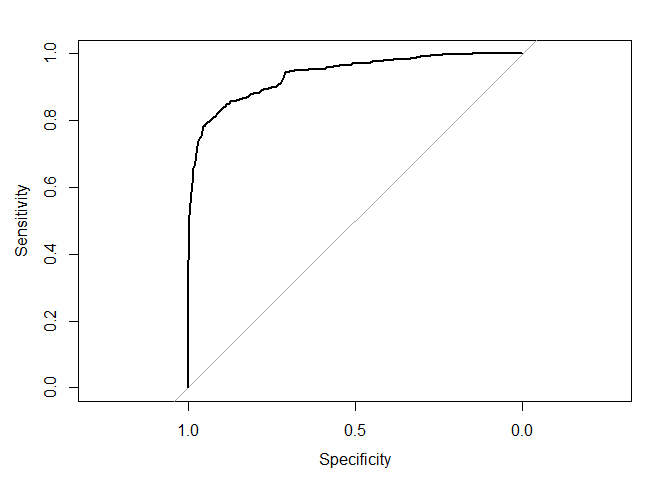

Properties_Classification
================

For the classification analysis we are going to use property data again,
but this time it has an additional column.

Let’s load the properties and take a look with the glimpse function

``` r
library(tidyverse)

propiedades <- read_csv("propiedades2.csv")

propiedades %>% glimpse()
```

    ## Rows: 3,000
    ## Columns: 9
    ## $ Precio           <dbl> 1384, 2006, 1685, 1242, 1592, 1292, 1900, 1268, 7500,…
    ## $ Terreno          <dbl> 69, 45, 47, 25, 34, 29, 114, 37, 133, 33, 160, 31, 13…
    ## $ Construido       <dbl> 69, 45, 47, 25, 34, 29, 65, 37, 133, 33, 84, 31, 138,…
    ## $ Año_Construccion <dbl> 1972, 1996, 2010, 2005, 2010, 2010, 2012, 2001, 1997,…
    ## $ densidad_barrio  <dbl> 160.45882, 105.82421, 1295.27435, 202.47675, 728.8508…
    ## $ colegio_15m      <dbl> 0, 1, 1, 0, 1, 0, 0, 0, 0, 1, 0, 0, 1, 0, 1, 0, 1, 0,…
    ## $ jardin_15m       <dbl> 1, 1, 1, 1, 1, 1, 0, 1, 1, 1, 1, 1, 1, 1, 1, 0, 0, 1,…
    ## $ trabajo_15m      <dbl> 0, 0, 0, 0, 1, 0, 0, 0, 1, 1, 0, 0, 0, 0, 0, 0, 0, 0,…
    ## $ es_depto         <lgl> TRUE, TRUE, TRUE, TRUE, TRUE, TRUE, FALSE, TRUE, TRUE…

We see that the data now has a column called es_depto, which has values
TRUE or FALSE. This represents whether they are apartments or houses.

Now let’s see if we can classify the entities into apartments or houses
using a classification model. In particular we will use a logistic
regression.

We will do the first model with a simple logistic function, which is
done with the glm function that is in R base

``` r
modelo_logistico <- glm(es_depto ~ Terreno, propiedades, family = "binomial")

summary(modelo_logistico)
```

    ## 
    ## Call:
    ## glm(formula = es_depto ~ Terreno, family = "binomial", data = propiedades)
    ## 
    ## Coefficients:
    ##             Estimate Std. Error z value Pr(>|z|)    
    ## (Intercept)  4.33448    0.15035   28.83   <2e-16 ***
    ## Terreno     -0.03027    0.00120  -25.23   <2e-16 ***
    ## ---
    ## Signif. codes:  0 '***' 0.001 '**' 0.01 '*' 0.05 '.' 0.1 ' ' 1
    ## 
    ## (Dispersion parameter for binomial family taken to be 1)
    ## 
    ##     Null deviance: 3920.5  on 2999  degrees of freedom
    ## Residual deviance: 2087.3  on 2998  degrees of freedom
    ## AIC: 2091.3
    ## 
    ## Number of Fisher Scoring iterations: 7

The regression results tell us that both the intercept and the terrain
are statistically significant variables for classifying a property.

This model does not provide a determination coefficient since this value
does not make sense in classification problems. Given this, to calculate
the goodness of the model we are going to calculate the value of the
area under the ROC curve, known as AUC.

This calculation is implemented in the pROC library

``` r
library(pROC)

prob <- predict(modelo_logistico,type=c("response"))

propiedades$prob <- prob

curva_roc <- roc(es_depto ~ prob, data = propiedades)

plot(curva_roc)    
```

<!-- -->

``` r
auc(curva_roc)
```

    ## Area under the curve: 0.9366

We see that the AUC value is 93%, which means that the model has great
classification power. Now we are going to see if the AUC improves by
incorporating more variables, using a multivariable logistic model.

``` r
propiedades$prob <- NULL

modelo_logistico_multi <- glm(es_depto ~ ., propiedades, family = "binomial")

summary(modelo_logistico_multi)
```

    ## 
    ## Call:
    ## glm(formula = es_depto ~ ., family = "binomial", data = propiedades)
    ## 
    ## Coefficients:
    ##                    Estimate Std. Error z value Pr(>|z|)    
    ## (Intercept)      -7.128e+01  1.613e+01  -4.419 9.92e-06 ***
    ## Precio            4.106e-04  5.575e-05   7.365 1.77e-13 ***
    ## Terreno          -2.329e-01  1.812e-02 -12.858  < 2e-16 ***
    ## Construido        2.032e-01  1.704e-02  11.925  < 2e-16 ***
    ## Año_Construccion  3.785e-02  8.041e-03   4.707 2.51e-06 ***
    ## densidad_barrio   1.255e-03  8.461e-04   1.484 0.137873    
    ## colegio_15m       2.748e+00  8.233e-01   3.338 0.000843 ***
    ## jardin_15m        7.048e-02  5.167e-01   0.136 0.891509    
    ## trabajo_15m       1.354e+00  9.832e-01   1.377 0.168478    
    ## ---
    ## Signif. codes:  0 '***' 0.001 '**' 0.01 '*' 0.05 '.' 0.1 ' ' 1
    ## 
    ## (Dispersion parameter for binomial family taken to be 1)
    ## 
    ##     Null deviance: 3920.5  on 2999  degrees of freedom
    ## Residual deviance:  375.4  on 2991  degrees of freedom
    ## AIC: 393.4
    ## 
    ## Number of Fisher Scoring iterations: 12

``` r
propiedades$prob_multi <- predict(modelo_logistico_multi, type=c("response"))

auc(roc(es_depto ~ prob_multi, data = propiedades))
```

    ## Area under the curve: 0.9897

By including all the variables we see that some of them have statistical
significance, but others do not, so they should be discarded in the
model.

The AUC improved from 93% to 98%, which means that in 98% of cases the
entities are successfully classified. These results may occur due to
overtraining of the model, so we will test with a training set and a
test set.

``` r
set.seed(42)
muestra <- sample(1:nrow(propiedades), nrow(propiedades)*.8)

data_train <- propiedades[muestra,]
data_test <- propiedades[-muestra,]

modelo_logistico_multi <- glm(es_depto ~ Precio + Terreno + Construido + Año_Construccion + colegio_15m, data_train, family = "binomial")

summary(modelo_logistico_multi)
```

    ## 
    ## Call:
    ## glm(formula = es_depto ~ Precio + Terreno + Construido + Año_Construccion + 
    ##     colegio_15m, family = "binomial", data = data_train)
    ## 
    ## Coefficients:
    ##                    Estimate Std. Error z value Pr(>|z|)    
    ## (Intercept)      -5.803e+01  1.753e+01  -3.310 0.000934 ***
    ## Precio            4.021e-04  5.739e-05   7.006 2.45e-12 ***
    ## Terreno          -2.473e-01  2.076e-02 -11.912  < 2e-16 ***
    ## Construido        2.164e-01  1.955e-02  11.068  < 2e-16 ***
    ## Año_Construccion  3.157e-02  8.808e-03   3.585 0.000337 ***
    ## colegio_15m       2.653e+00  8.679e-01   3.057 0.002236 ** 
    ## ---
    ## Signif. codes:  0 '***' 0.001 '**' 0.01 '*' 0.05 '.' 0.1 ' ' 1
    ## 
    ## (Dispersion parameter for binomial family taken to be 1)
    ## 
    ##     Null deviance: 3130.61  on 2399  degrees of freedom
    ## Residual deviance:  288.48  on 2394  degrees of freedom
    ## AIC: 300.48
    ## 
    ## Number of Fisher Scoring iterations: 12

``` r
data_test$prob_multi <- predict(modelo_logistico_multi, data_test, type=c("response"))

auc(roc(es_depto ~ prob_multi, data = data_test))
```

    ## Area under the curve: 0.9839

We see that the AUC dropped a little from 98.9% to 98.4% but it is still
an excellent result, and since the training set was different from the
test set, we can say that the model was not overtrained.
