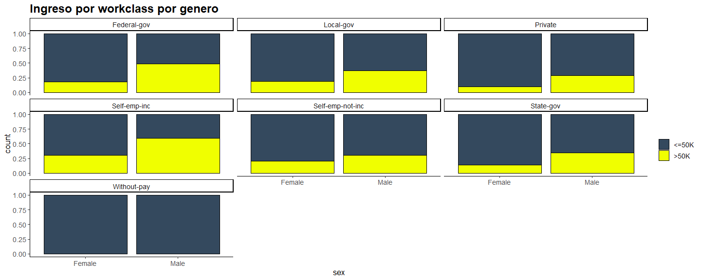
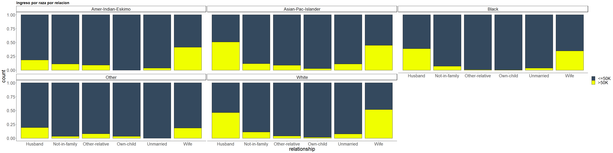
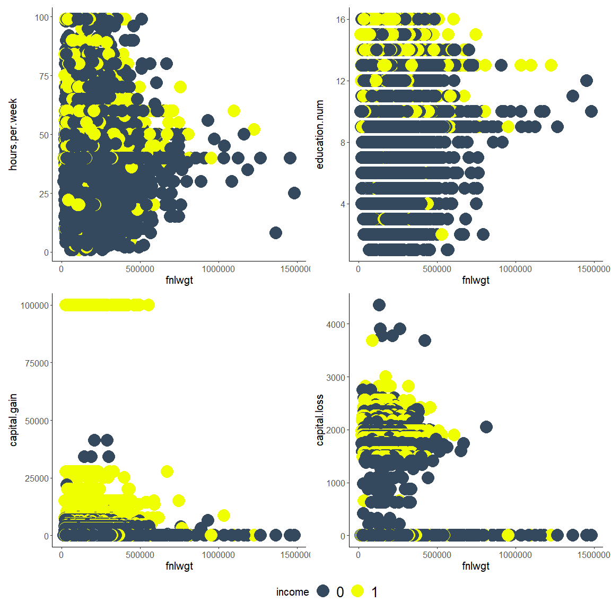

Ayudantia 11 Arboles de Decision
================

## Actividad Ayudantia 11

  - Para la actividad de esta ayudantia realizaran el analisis de arbol
    de decision a partir de alguno de los dos data sets que quedaron
    subidos. Para el caso de Credit Card el objetivo sera clasificar si
    el cliente va a pagar o no el credito que adeuda. Mientras para el
    caso de Hotel Bookings el objetivo sera determinar si la reserva del
    hotel sera o no cancelada. (Comparen los resultados obtenidos
    mediante arboles de decision con los modelos de regresion logistica,
    naive bayes y KNN)

## Ayudantia 11

  - Para esta ayudantia utilizaremos el dataset Adult Census
    (<https://www.kaggle.com/uciml/adult-census-income>) en el link
    podran en contrar mas detalles del dataset.
  - El objetivo es utilizar el modelo de arboles de decision que nos
    permita clasificar si ingreso es \<=50K o \>50K, para luego generar
    una prediccion a partir de nuestro modelo. Evaluaremos los
    resultados del modelo y realizaremos un acercamiento a lo que es el
    tuneo de modelos.

## Arboles de Decision (modelo CART)

  - Algoritmo de aprendizaje automatico supervisado que se puede
    utilizar tanto para problemas de clasificacion como para problemas
    de regresion, por lo que tambien se lo conoce como modelo CART
    (arboles de clasificacion y regresion)

  - ¿Como funciona? La idea detras de los arboles de decision es
    realizar multiples divisiones en el conjunto de datos para tomar una
    decision

## Cargamos las librerias

``` r
library(plyr)
library(ggplot2)
library(tidyverse)
library(tidymodels)
library(discrim)
library(caret)
library(pROC)
```

## Cargamos los datos

``` r
setwd("D:/Users/Italo/Documents/Italo Felipe/UAI/Semestre 11/Ayudantia Mineria de Datos/material ayudantia/DataSets")

# adult <- read.csv("D:/Users/Italo/Documents/Italo Felipe/UAI/Semestre 11/Ayudantia Mineria de Datos/material ayudantia/DataSets/adult.csv")

adult <- read.csv("D:/Users/Italo/Documents/Italo Felipe/UAI/Semestre 11/Ayudantia Mineria de Datos/material ayudantia/DataSets/adult.csv", na.strings = c("","NA"," ","?"))
```

``` r
head(adult)
```

    ##   age workclass fnlwgt    education education.num marital.status
    ## 1  90      <NA>  77053      HS-grad             9        Widowed
    ## 2  82   Private 132870      HS-grad             9        Widowed
    ## 3  66      <NA> 186061 Some-college            10        Widowed
    ## 4  54   Private 140359      7th-8th             4       Divorced
    ## 5  41   Private 264663 Some-college            10      Separated
    ## 6  34   Private 216864      HS-grad             9       Divorced
    ##          occupation  relationship  race    sex capital.gain capital.loss
    ## 1              <NA> Not-in-family White Female            0         4356
    ## 2   Exec-managerial Not-in-family White Female            0         4356
    ## 3              <NA>     Unmarried Black Female            0         4356
    ## 4 Machine-op-inspct     Unmarried White Female            0         3900
    ## 5    Prof-specialty     Own-child White Female            0         3900
    ## 6     Other-service     Unmarried White Female            0         3770
    ##   hours.per.week native.country income
    ## 1             40  United-States  <=50K
    ## 2             18  United-States  <=50K
    ## 3             40  United-States  <=50K
    ## 4             40  United-States  <=50K
    ## 5             40  United-States  <=50K
    ## 6             45  United-States  <=50K

``` r
summary(adult)
```

    ##       age                   workclass         fnlwgt       
    ##  Min.   :17.00   Private         :22696   Min.   :  12285  
    ##  1st Qu.:28.00   Self-emp-not-inc: 2541   1st Qu.: 117827  
    ##  Median :37.00   Local-gov       : 2093   Median : 178356  
    ##  Mean   :38.58   State-gov       : 1298   Mean   : 189778  
    ##  3rd Qu.:48.00   Self-emp-inc    : 1116   3rd Qu.: 237051  
    ##  Max.   :90.00   (Other)         :  981   Max.   :1484705  
    ##                  NA's            : 1836                    
    ##         education     education.num                 marital.status 
    ##  HS-grad     :10501   Min.   : 1.00   Divorced             : 4443  
    ##  Some-college: 7291   1st Qu.: 9.00   Married-AF-spouse    :   23  
    ##  Bachelors   : 5355   Median :10.00   Married-civ-spouse   :14976  
    ##  Masters     : 1723   Mean   :10.08   Married-spouse-absent:  418  
    ##  Assoc-voc   : 1382   3rd Qu.:12.00   Never-married        :10683  
    ##  11th        : 1175   Max.   :16.00   Separated            : 1025  
    ##  (Other)     : 5134                   Widowed              :  993  
    ##            occupation            relationship                   race      
    ##  Prof-specialty : 4140   Husband       :13193   Amer-Indian-Eskimo:  311  
    ##  Craft-repair   : 4099   Not-in-family : 8305   Asian-Pac-Islander: 1039  
    ##  Exec-managerial: 4066   Other-relative:  981   Black             : 3124  
    ##  Adm-clerical   : 3770   Own-child     : 5068   Other             :  271  
    ##  Sales          : 3650   Unmarried     : 3446   White             :27816  
    ##  (Other)        :10993   Wife          : 1568                             
    ##  NA's           : 1843                                                    
    ##      sex         capital.gain    capital.loss    hours.per.week 
    ##  Female:10771   Min.   :    0   Min.   :   0.0   Min.   : 1.00  
    ##  Male  :21790   1st Qu.:    0   1st Qu.:   0.0   1st Qu.:40.00  
    ##                 Median :    0   Median :   0.0   Median :40.00  
    ##                 Mean   : 1078   Mean   :  87.3   Mean   :40.44  
    ##                 3rd Qu.:    0   3rd Qu.:   0.0   3rd Qu.:45.00  
    ##                 Max.   :99999   Max.   :4356.0   Max.   :99.00  
    ##                                                                 
    ##        native.country    income     
    ##  United-States:29170   <=50K:24720  
    ##  Mexico       :  643   >50K : 7841  
    ##  Philippines  :  198                
    ##  Germany      :  137                
    ##  Canada       :  121                
    ##  (Other)      : 1709                
    ##  NA's         :  583

``` r
str(adult)
```

    ## 'data.frame':    32561 obs. of  15 variables:
    ##  $ age           : int  90 82 66 54 41 34 38 74 68 41 ...
    ##  $ workclass     : Factor w/ 8 levels "Federal-gov",..: NA 4 NA 4 4 4 4 7 1 4 ...
    ##  $ fnlwgt        : int  77053 132870 186061 140359 264663 216864 150601 88638 422013 70037 ...
    ##  $ education     : Factor w/ 16 levels "10th","11th",..: 12 12 16 6 16 12 1 11 12 16 ...
    ##  $ education.num : int  9 9 10 4 10 9 6 16 9 10 ...
    ##  $ marital.status: Factor w/ 7 levels "Divorced","Married-AF-spouse",..: 7 7 7 1 6 1 6 5 1 5 ...
    ##  $ occupation    : Factor w/ 14 levels "Adm-clerical",..: NA 4 NA 7 10 8 1 10 10 3 ...
    ##  $ relationship  : Factor w/ 6 levels "Husband","Not-in-family",..: 2 2 5 5 4 5 5 3 2 5 ...
    ##  $ race          : Factor w/ 5 levels "Amer-Indian-Eskimo",..: 5 5 3 5 5 5 5 5 5 5 ...
    ##  $ sex           : Factor w/ 2 levels "Female","Male": 1 1 1 1 1 1 2 1 1 2 ...
    ##  $ capital.gain  : int  0 0 0 0 0 0 0 0 0 0 ...
    ##  $ capital.loss  : int  4356 4356 4356 3900 3900 3770 3770 3683 3683 3004 ...
    ##  $ hours.per.week: int  40 18 40 40 40 45 40 20 40 60 ...
    ##  $ native.country: Factor w/ 41 levels "Cambodia","Canada",..: 39 39 39 39 39 39 39 39 39 NA ...
    ##  $ income        : Factor w/ 2 levels "<=50K",">50K": 1 1 1 1 1 1 1 2 1 2 ...

## Transformamos la variable income

``` r
#Map 0 to 1 the adult feature
adult$income <- mapvalues(adult$income, from=c('>50K', '<=50K'), to=c(1,0))
```

``` r
adult %>% 
  summarise_all(funs(sum(is.na(.))))
```

    ## Warning: `funs()` was deprecated in dplyr 0.8.0.
    ## Please use a list of either functions or lambdas: 
    ## 
    ##   # Simple named list: 
    ##   list(mean = mean, median = median)
    ## 
    ##   # Auto named with `tibble::lst()`: 
    ##   tibble::lst(mean, median)
    ## 
    ##   # Using lambdas
    ##   list(~ mean(., trim = .2), ~ median(., na.rm = TRUE))

    ##   age workclass fnlwgt education education.num marital.status occupation
    ## 1   0      1836      0         0             0              0       1843
    ##   relationship race sex capital.gain capital.loss hours.per.week native.country
    ## 1            0    0   0            0            0              0            583
    ##   income
    ## 1      0

``` r
adult <- adult %>% filter(!(is.na(workclass))) %>% filter(!(is.na(occupation))) %>% filter(!(is.na(native.country)))

adult %>% 
  summarise_all(funs(sum(is.na(.))))
```

    ##   age workclass fnlwgt education education.num marital.status occupation
    ## 1   0         0      0         0             0              0          0
    ##   relationship race sex capital.gain capital.loss hours.per.week native.country
    ## 1            0    0   0            0            0              0              0
    ##   income
    ## 1      0

## Exploracion de los datos

``` r
table(adult$income)
```

    ## 
    ##     0     1 
    ## 22654  7508

``` r
target_count <- ggplot(adult, aes(x = income)) + 
geom_bar(color="black",width = 0.9) +
coord_flip() + 
theme_classic() +
theme(text=element_text(size = 15,  family="sans")) + 
theme(legend.position = "none") + 
scale_y_continuous(name = " ", limits = c(0,24000)) + 
ggtitle("Count Plot") + 
theme(plot.title = element_text(size = 20, face = "bold"))

target_count
```

<!-- -->

``` r
table(adult$workclass)
```

    ## 
    ##      Federal-gov        Local-gov     Never-worked          Private 
    ##              943             2067                0            22286 
    ##     Self-emp-inc Self-emp-not-inc        State-gov      Without-pay 
    ##             1074             2499             1279               14

``` r
plot1 <- ggplot(adult, aes(x = sex, fill = income)) + 
scale_fill_manual(name = " ", labels = c("<=50K", ">50K"), values = c("1" = "#F0FF00","0"="#34495E")) +
geom_bar(color="black",position="fill") + #black outline of the bars
facet_wrap(factor(workclass) ~ .) +
#coord_flip() + #flip the axes
theme_classic() + #classic theme for cleaner look
theme(text=element_text(size=13,  family="sans")) + #Font change to sans
theme(legend.position = "right") + 
#scale_y_discrete(name = " ", limits = c("Federal-gov","Female")) +
#scale_x_discrete(name = " ", limits = c("F", "M")) +
ggtitle("Ingreso por workclass por genero") + #axis name and order of labels
theme(plot.title = element_text(size = 18, family="sans", face = "bold"))

plot1
```

<!-- -->

``` r
plot2 <- ggplot(adult, aes(x = relationship, fill = income)) + 
scale_fill_manual(name = " ", labels = c("<=50K", ">50K"), values = c("1" = "#F0FF00","0"="#34495E")) +
geom_bar(color="black",position="fill") + #black outline of the bars
facet_wrap(factor(race) ~ .) +
#coord_flip() + #flip the axes
theme_classic() + #classic theme for cleaner look
theme(text=element_text(size=25,  family="sans")) + #Font change to sans
theme(legend.position = "right") + 
#scale_y_discrete(name = " ", limits = c("Federal-gov","Female")) +
#scale_x_discrete(name = " ", limits = c("F", "M")) +
ggtitle("Ingreso por raza por relacion") + #axis name and order of labels
theme(plot.title = element_text(size = 18, family="sans", face = "bold"))

plot2
```

<!-- -->

``` r
library(patchwork)

plot3 <- ggplot(adult,aes(fnlwgt, hours.per.week, color=income)) + 
  geom_point(size = 8) + 
  scale_color_manual(values = c('#34495E','#F0FF00')) + 
  theme(legend.position = "bottom") +
  theme_classic() +
  theme(text=element_text(size=15,  family="sans"))

plot4 <- ggplot(adult,aes(fnlwgt, education.num, color=income)) + 
  geom_point(size = 8) + 
  scale_color_manual(values = c('#34495E','#F0FF00')) + 
  theme(legend.position = "bottom") +
  theme_classic() +
  theme(text=element_text(size=15,  family="sans"))

plot5 <- ggplot(adult,aes(fnlwgt, capital.gain, color=income)) + 
  geom_point(size = 8) + 
  scale_color_manual(values = c('#34495E','#F0FF00')) + 
  theme(legend.position = "bottom") +
  theme_classic() +
  theme(text=element_text(size=15,  family="sans"))

plot6 <- ggplot(adult,aes(fnlwgt, capital.loss, color=income)) + 
  geom_point(size = 8) + 
  scale_color_manual(values = c('#34495E','#F0FF00')) + 
  theme(legend.position = "bottom") +
  theme_classic() +
  theme(text=element_text(size=15,  family="sans"))


combined <- plot3 + plot4 + plot5 + plot6 & theme(legend.position = "bottom") + theme(legend.text=element_text(size=20))
combined + plot_layout(guides = "collect")
```

<!-- -->

## Implementacion Decision Trees, separar data en Test y Train

``` r
library(tidymodels)

data_split <- initial_split(adult, prop = 0.8)

# Create data frames for the two sets:
train_data <- training(data_split) 
test_data <- testing(data_split)

str(train_data)
```

    ## 'data.frame':    24130 obs. of  15 variables:
    ##  $ age           : int  82 54 41 34 38 74 68 38 52 32 ...
    ##  $ workclass     : Factor w/ 8 levels "Federal-gov",..: 4 4 4 4 4 7 1 6 4 4 ...
    ##  $ fnlwgt        : int  132870 140359 264663 216864 150601 88638 422013 164526 129177 136204 ...
    ##  $ education     : Factor w/ 16 levels "10th","11th",..: 12 6 16 12 1 11 12 15 10 13 ...
    ##  $ education.num : int  9 4 10 9 6 16 9 15 13 14 ...
    ##  $ marital.status: Factor w/ 7 levels "Divorced","Married-AF-spouse",..: 7 1 6 1 6 5 1 5 7 6 ...
    ##  $ occupation    : Factor w/ 14 levels "Adm-clerical",..: 4 7 10 8 1 10 10 10 8 4 ...
    ##  $ relationship  : Factor w/ 6 levels "Husband","Not-in-family",..: 2 5 4 5 5 3 2 2 2 2 ...
    ##  $ race          : Factor w/ 5 levels "Amer-Indian-Eskimo",..: 5 5 5 5 5 5 5 5 5 5 ...
    ##  $ sex           : Factor w/ 2 levels "Female","Male": 1 1 1 1 2 1 1 2 1 2 ...
    ##  $ capital.gain  : int  0 0 0 0 0 0 0 0 0 0 ...
    ##  $ capital.loss  : int  4356 3900 3900 3770 3770 3683 3683 2824 2824 2824 ...
    ##  $ hours.per.week: int  18 40 40 45 40 20 40 45 20 55 ...
    ##  $ native.country: Factor w/ 41 levels "Cambodia","Canada",..: 39 39 39 39 39 39 39 39 39 39 ...
    ##  $ income        : Factor w/ 2 levels "0","1": 1 1 1 1 1 2 1 2 2 2 ...

``` r
str(test_data)
```

    ## 'data.frame':    6032 obs. of  15 variables:
    ##  $ age           : int  45 52 43 38 33 37 55 39 42 46 ...
    ##  $ workclass     : Factor w/ 8 levels "Federal-gov",..: 4 4 4 4 4 4 5 4 4 4 ...
    ##  $ fnlwgt        : int  172274 198863 289669 237608 194901 329980 124137 179731 154374 326857 ...
    ##  $ education     : Factor w/ 16 levels "10th","11th",..: 11 15 13 10 9 13 15 13 10 13 ...
    ##  $ education.num : int  16 15 14 13 11 14 15 14 13 14 ...
    ##  $ marital.status: Factor w/ 7 levels "Divorced","Married-AF-spouse",..: 1 1 1 5 6 3 3 3 3 3 ...
    ##  $ occupation    : Factor w/ 14 levels "Adm-clerical",..: 10 4 10 12 3 4 10 4 4 12 ...
    ##  $ relationship  : Factor w/ 6 levels "Husband","Not-in-family",..: 5 2 5 2 2 1 1 6 1 1 ...
    ##  $ race          : Factor w/ 5 levels "Amer-Indian-Eskimo",..: 3 5 5 5 5 5 5 5 5 5 ...
    ##  $ sex           : Factor w/ 2 levels "Female","Male": 1 2 1 1 2 2 2 1 2 2 ...
    ##  $ capital.gain  : int  0 0 0 0 0 0 0 0 0 0 ...
    ##  $ capital.loss  : int  3004 2559 2547 2444 2444 2415 2415 2415 2415 2415 ...
    ##  $ hours.per.week: int  35 60 40 45 42 60 35 65 60 65 ...
    ##  $ native.country: Factor w/ 41 levels "Cambodia","Canada",..: 39 39 39 39 39 39 12 39 39 39 ...
    ##  $ income        : Factor w/ 2 levels "0","1": 2 2 2 2 2 2 2 2 2 2 ...

## Seleccion de Atributos

  - Si lo pensamos bien, marital.status y relationship son atributos que
    estan algo relacionadas. Lo mismo ocurre con education.num y
    education. Ademas hay atributos que no tienen mucha importancia para
    el analisis que tambien eliminaremos.

<!-- end list -->

``` r
train <- subset(train_data, select = - c(relationship, education.num, race, native.country, capital.loss, fnlwgt, hours.per.week, workclass))
test <- subset(test_data, select = - c(relationship, education.num, race, native.country, capital.loss, fnlwgt, hours.per.week, workclass))
```

## Crear Modelo

  - Primero creamos la receta de nuestro modelo

<!-- end list -->

``` r
receta <- 
  recipe(income ~ ., data = train)

receta
```

    ## Data Recipe
    ## 
    ## Inputs:
    ## 
    ##       role #variables
    ##    outcome          1
    ##  predictor          6

  - Luego procedemos a crear nuestro modelo de arbol de decision con 5
    capas de decision, y un minimo numero de entidades por hoja (poda)
    de 10. La libreria que se utiliza para calcular este modelo sera la
    de rpart, que viene precargada en los paquetes que estamos
    utilizando. Con este paso solo definimos el modelo, aun no lo
    calculamos.

<!-- end list -->

``` r
modelo_trees <-
  decision_tree(tree_depth = 5, min_n = 10) %>% 
  set_engine("rpart") %>% 
  set_mode("classification")

modelo_trees
```

    ## Decision Tree Model Specification (classification)
    ## 
    ## Main Arguments:
    ##   tree_depth = 5
    ##   min_n = 10
    ## 
    ## Computational engine: rpart

  - Ahora hacemos el fit del modelo, calculamos sus predicciones y
    calculamos el valor de AUC

<!-- end list -->

``` r
fit_mod <- function(mod){
  
  modelo_fit <- 
  workflow() %>% 
  add_model(mod) %>% 
  add_recipe(receta) %>% 
  fit(data = train)

model_pred <- 
  predict(modelo_fit, test, type = "prob") %>% 
  bind_cols(test) 

return(model_pred %>% 
  roc_auc(truth = income, .pred_0))
}

fit_mod(modelo_trees)
```

    ## # A tibble: 1 x 3
    ##   .metric .estimator .estimate
    ##   <chr>   <chr>          <dbl>
    ## 1 roc_auc binary         0.846

  - Ahora compararemos con otros modelos (regresion logistica, naive
    bayes o KNN), aprovechando que la libreria tidymodels nos facilita
    realizar esta comparacion. Lo unico que debemos cambiar es el
    modelo, ya que utilizamos la misma receta y el mismo flujo de
    validacion para el modelo. Por lo que podemos reutilizar lo que
    hicimos arriba

## Regresion Logistica

``` r
modelo_rl <- 
  logistic_reg() %>% 
  set_engine("glm")

fit_mod(modelo_rl)
```

    ## Warning: glm.fit: fitted probabilities numerically 0 or 1 occurred

    ## # A tibble: 1 x 3
    ##   .metric .estimator .estimate
    ##   <chr>   <chr>          <dbl>
    ## 1 roc_auc binary         0.895

## Naive Bayes

``` r
library(naivebayes)
```

    ## naivebayes 0.9.7 loaded

``` r
modelo_nb <-
  naive_Bayes(smoothness = .8) %>%
  set_engine("naivebayes")

fit_mod(modelo_nb)
```

    ## Warning: naive_bayes(): Feature education - zero probabilities are present.
    ## Consider Laplace smoothing.

    ## # A tibble: 1 x 3
    ##   .metric .estimator .estimate
    ##   <chr>   <chr>          <dbl>
    ## 1 roc_auc binary         0.881

## KNN

``` r
library(kknn)
```

    ## 
    ## Attaching package: 'kknn'

    ## The following object is masked from 'package:caret':
    ## 
    ##     contr.dummy

``` r
modelo_knn <-
  nearest_neighbor(neighbors = 5) %>% 
  set_engine("kknn") %>% 
  set_mode("classification")

fit_mod(modelo_knn)
```

    ## # A tibble: 1 x 3
    ##   .metric .estimator .estimate
    ##   <chr>   <chr>          <dbl>
    ## 1 roc_auc binary         0.845

  - Podemos ver que en este caso el modelo de Naive Bayes y el modelo de
    Regresion Logistica son los que obtienen los mejores resultados al
    clasificar con un AUC de .89-.088.

<!-- end list -->

``` r
library(rpart)
```

    ## 
    ## Attaching package: 'rpart'

    ## The following object is masked from 'package:dials':
    ## 
    ##     prune

``` r
library(rpart.plot)

censo <- rpart(income~., data = train, method = "class")

rpart.plot(censo)
```

<!-- -->

## Predict

``` r
pred_income <- predict(censo, newdata = test, type = "class")
pred_income %>% as.data.frame() %>% head()
```

    ##    .
    ## 8  0
    ## 27 0
    ## 38 0
    ## 50 0
    ## 51 0
    ## 57 1

``` r
pred_income %>% as.data.frame() %>% tail()
```

    ##       .
    ## 30141 1
    ## 30150 0
    ## 30151 0
    ## 30156 0
    ## 30159 0
    ## 30160 0

``` r
test_data$predictedincome <- pred_income
```

``` r
## Prob para curva ROC

pred_incom_roc <- predict(censo, newdata = test, type = "prob")
pred_incom_roc %>% as.data.frame() %>% head()
```

    ##            0          1
    ## 8  0.9473394 0.05266062
    ## 27 0.9473394 0.05266062
    ## 38 0.9473394 0.05266062
    ## 50 0.9473394 0.05266062
    ## 51 0.9473394 0.05266062
    ## 57 0.2685269 0.73147315

``` r
pred_incom_roc %>% as.data.frame() %>% tail()
```

    ##               0          1
    ## 30141 0.2685269 0.73147315
    ## 30150 0.9473394 0.05266062
    ## 30151 0.6992240 0.30077602
    ## 30156 0.9473394 0.05266062
    ## 30159 0.6992240 0.30077602
    ## 30160 0.6992240 0.30077602

``` r
pred_incom_roc <- pred_incom_roc %>% as.data.frame()
prob <- pred_incom_roc$"1"
```

## Evaluar Modelo

``` r
cm <- confusionMatrix(table(test_data$income, test_data$predictedincome))
test_data$predictedincome <- as.factor(test_data$predictedincome)

table <- data.frame(confusionMatrix(test_data$income, test_data$predictedincome)$table)

print(cm)
```

    ## Confusion Matrix and Statistics
    ## 
    ##    
    ##        0    1
    ##   0 4264  237
    ##   1  752  779
    ##                                           
    ##                Accuracy : 0.836           
    ##                  95% CI : (0.8265, 0.8453)
    ##     No Information Rate : 0.8316          
    ##     P-Value [Acc > NIR] : 0.1811          
    ##                                           
    ##                   Kappa : 0.5131          
    ##                                           
    ##  Mcnemar's Test P-Value : <2e-16          
    ##                                           
    ##             Sensitivity : 0.8501          
    ##             Specificity : 0.7667          
    ##          Pos Pred Value : 0.9473          
    ##          Neg Pred Value : 0.5088          
    ##              Prevalence : 0.8316          
    ##          Detection Rate : 0.7069          
    ##    Detection Prevalence : 0.7462          
    ##       Balanced Accuracy : 0.8084          
    ##                                           
    ##        'Positive' Class : 0               
    ## 

``` r
print(cm$byClass)
```

    ##          Sensitivity          Specificity       Pos Pred Value 
    ##            0.8500797            0.7667323            0.9473450 
    ##       Neg Pred Value            Precision               Recall 
    ##            0.5088178            0.9473450            0.8500797 
    ##                   F1           Prevalence       Detection Rate 
    ##            0.8960807            0.8315650            0.7068966 
    ## Detection Prevalence    Balanced Accuracy 
    ##            0.7461870            0.8084060

``` r
plotTable <- table %>%
  mutate(goodbad = ifelse(table$Prediction == table$Reference, "Good", "Bad")) %>%
  group_by(Reference) %>%
  mutate(prop = Freq/sum(Freq))

confusionMatrix <- ggplot(data = plotTable, mapping = aes(x = Reference, y = Prediction, fill = goodbad, alpha = prop)) +
  geom_tile() +
  geom_text(aes(label = Freq), vjust = .5, fontface  = "bold", alpha = 25, size = 8) +
  scale_fill_manual(name = " ", values = c(Good = "#F0FF00", Bad = "#34495E")) +
  scale_alpha(name = " ") +
  theme_classic() +
  xlim(rev(levels(table$Reference))) +
  scale_y_discrete(name = "Predicted", limits = c("1","0")) + 
  scale_x_discrete(name = "Actual", position = "top") +
  #theme(legend.position = " ") +
  theme(text=element_text(size=25,  family="sans")) + 
  ggtitle("Confusion Matrix") +
  theme(plot.title = element_text(size = 25, family="sans", face = "bold"))
```

    ## Scale for 'x' is already present. Adding another scale for 'x', which will
    ## replace the existing scale.

``` r
confusionMatrix
```

<!-- -->

## Curva ROC

``` r
ROC <- roc(test_data$income,prob)
```

    ## Setting levels: control = 0, case = 1

    ## Setting direction: controls < cases

``` r
plot(ROC, col = "#fd634b", family = "sans", cex = 2, main = "CART Model ROC Curve 
AUC = 0.8474")
```

<!-- -->

``` r
auc(ROC)
```

    ## Area under the curve: 0.8464

## Chequeo de Overfitting - Train vs Test Accuracy

``` r
is_predictedincome <- predict(censo,newdata=train_data,type='class')
misClassError <- mean(is_predictedincome != train_data$income)
print(paste('Train-set Accuracy =',1-misClassError))
```

    ## [1] "Train-set Accuracy = 0.841442188147534"

``` r
misClassError <- mean(test_data$predictedincome != test_data$income)
print(paste('Test-set Accuracy =',1-misClassError))
```

    ## [1] "Test-set Accuracy = 0.836041114058355"

  - Al observar los resultados del AUC y el accuracy del modelo, podemos
    concluir que el modelo CART hizo un buen trabajo de clasificacion.
    El accuracy del test y del train no estan my lejos una de la otra,
    lo que nos indica que el modelo no se supero.

  - Lo ultimo que veremos sera la optimizacion de hiperparametros para
    ver si podemos mejorar el resultado obtenido.

## Creando un modelo CART optimo: Tuneo Automatico

``` r
set.seed(823)
fitControl <- trainControl(method = "cv", number = 10,         
                      verboseIter = FALSE)


best_model <- train(income ~ ., data = train,            
                    method = "rpart",                     
                    trControl = fitControl,
                    tuneLength = 10)
best_model
```

    ## CART 
    ## 
    ## 24130 samples
    ##     6 predictor
    ##     2 classes: '0', '1' 
    ## 
    ## No pre-processing
    ## Resampling: Cross-Validated (10 fold) 
    ## Summary of sample sizes: 21717, 21716, 21717, 21717, 21717, 21717, ... 
    ## Resampling results across tuning parameters:
    ## 
    ##   cp           Accuracy   Kappa    
    ##   0.001171156  0.8439701  0.5412071
    ##   0.001254810  0.8435556  0.5404255
    ##   0.001422118  0.8435143  0.5410638
    ##   0.003346160  0.8426026  0.5453789
    ##   0.005353856  0.8416494  0.5445255
    ##   0.006023089  0.8409036  0.5434843
    ##   0.027271206  0.8355165  0.5147757
    ##   0.036473147  0.8242850  0.4551339
    ##   0.052200100  0.8154166  0.4104007
    ##   0.076041492  0.7801881  0.1847591
    ## 
    ## Accuracy was used to select the optimal model using the largest value.
    ## The final value used for the model was cp = 0.001171156.

``` r
best_model$bestTune
```

    ##            cp
    ## 1 0.001171156

## Predict

``` r
pred_income <- predict(best_model, newdata = test, type = "raw")
pred_income %>% as.data.frame() %>% head()
```

    ##   .
    ## 1 0
    ## 2 0
    ## 3 0
    ## 4 0
    ## 5 0
    ## 6 1

``` r
pred_income %>% as.data.frame() %>% tail()
```

    ##      .
    ## 6027 1
    ## 6028 0
    ## 6029 0
    ## 6030 0
    ## 6031 0
    ## 6032 0

``` r
test_data$predictedincome <- pred_income
```

``` r
## Prob para curva ROC

pred_incom_roc <- predict(best_model, newdata = test, type = "prob")
pred_incom_roc %>% as.data.frame() %>% head()
```

    ##            0          1
    ## 8  0.9468420 0.05315798
    ## 27 0.9468420 0.05315798
    ## 38 0.9468420 0.05315798
    ## 50 0.9468420 0.05315798
    ## 51 0.9468420 0.05315798
    ## 57 0.1477833 0.85221675

``` r
pred_incom_roc %>% as.data.frame() %>% tail()
```

    ##               0          1
    ## 30141 0.2436647 0.75633528
    ## 30150 0.9468420 0.05315798
    ## 30151 0.7256569 0.27434312
    ## 30156 0.9468420 0.05315798
    ## 30159 0.7256569 0.27434312
    ## 30160 0.7256569 0.27434312

``` r
pred_incom_roc <- pred_incom_roc %>% as.data.frame()
prob <- pred_incom_roc$"1"
```

## Evaluar Modelo

``` r
cm <- confusionMatrix(table(test_data$income, test_data$predictedincome))
test_data$predictedincome <- as.factor(test_data$predictedincome)

table <- data.frame(confusionMatrix(test_data$income, test_data$predictedincome)$table)

print(cm)
```

    ## Confusion Matrix and Statistics
    ## 
    ##    
    ##        0    1
    ##   0 4236  265
    ##   1  716  815
    ##                                           
    ##                Accuracy : 0.8374          
    ##                  95% CI : (0.8278, 0.8466)
    ##     No Information Rate : 0.821           
    ##     P-Value [Acc > NIR] : 0.0004108       
    ##                                           
    ##                   Kappa : 0.5244          
    ##                                           
    ##  Mcnemar's Test P-Value : < 2.2e-16       
    ##                                           
    ##             Sensitivity : 0.8554          
    ##             Specificity : 0.7546          
    ##          Pos Pred Value : 0.9411          
    ##          Neg Pred Value : 0.5323          
    ##              Prevalence : 0.8210          
    ##          Detection Rate : 0.7023          
    ##    Detection Prevalence : 0.7462          
    ##       Balanced Accuracy : 0.8050          
    ##                                           
    ##        'Positive' Class : 0               
    ## 

``` r
print(cm$byClass)
```

    ##          Sensitivity          Specificity       Pos Pred Value 
    ##            0.8554120            0.7546296            0.9411242 
    ##       Neg Pred Value            Precision               Recall 
    ##            0.5323318            0.9411242            0.8554120 
    ##                   F1           Prevalence       Detection Rate 
    ##            0.8962234            0.8209549            0.7022546 
    ## Detection Prevalence    Balanced Accuracy 
    ##            0.7461870            0.8050208

``` r
plotTable <- table %>%
  mutate(goodbad = ifelse(table$Prediction == table$Reference, "Good", "Bad")) %>%
  group_by(Reference) %>%
  mutate(prop = Freq/sum(Freq))

confusionMatrix <- ggplot(data = plotTable, mapping = aes(x = Reference, y = Prediction, fill = goodbad, alpha = prop)) +
  geom_tile() +
  geom_text(aes(label = Freq), vjust = .5, fontface  = "bold", alpha = 25, size = 8) +
  scale_fill_manual(name = " ", values = c(Good = "#F0FF00", Bad = "#34495E")) +
  scale_alpha(name = " ") +
  theme_classic() +
  xlim(rev(levels(table$Reference))) +
  scale_y_discrete(name = "Predicted", limits = c("1","0")) + 
  scale_x_discrete(name = "Actual", position = "top") +
  #theme(legend.position = " ") +
  theme(text=element_text(size=25,  family="sans")) + 
  ggtitle("Confusion Matrix") +
  theme(plot.title = element_text(size = 25, family="sans", face = "bold"))
```

    ## Scale for 'x' is already present. Adding another scale for 'x', which will
    ## replace the existing scale.

``` r
confusionMatrix
```

<!-- -->

## Curva ROC

``` r
library(pROC)

ROC <- roc(test_data$income,prob)
```

    ## Setting levels: control = 0, case = 1

    ## Setting direction: controls < cases

``` r
plot(ROC, col = "#fd634b", family = "sans", cex = 2, main = "CART Model ROC Curve 
AUC = 0.8648")
```

<!-- -->

``` r
auc(ROC)
```

    ## Area under the curve: 0.8563
